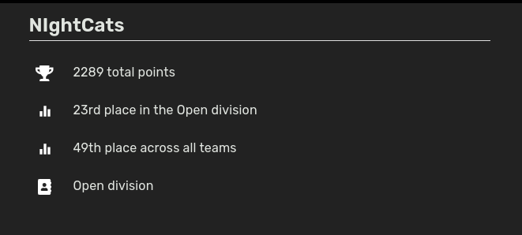

# Categories

--- 

- crypto (4/8 solved)

- misc (5/15 solved)

- pwn (2/9 solved)

- rev (2/5 solved)

- web (3/10 solved)

---

(672 teams)

## Results

## Wu

[web + reverse/emotionally_damaged](https://github.com/SuperStormer/writeups/tree/master/buckeyectf_2023/)

[real smooth + needle wifi + pong](https://meashiri.github.io/ctf-writeups/posts/202309-buckeyectf/)

[SloppyJoePirates ytb wu (5x crypto, 5x misc, 3x pwn, 2x rev, 7x web)](https://youtu.be/I-zBSHp9qOc)

[misc/parkour](./misc/non_solved/parkour)

[misc/pong](https://github.com/OliverRosenberg/CTF-WriteUps/tree/main/BuckeyeCTF%202023/pong-challenge)

[misc/smederij](./misc/non_solved/smederij)

[rev/skribl + another good wus](https://github.com/D13David/ctf-writeups/blob/main/buckeyectf23/rev/skribl/README.md)
