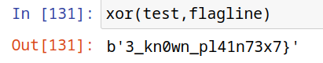
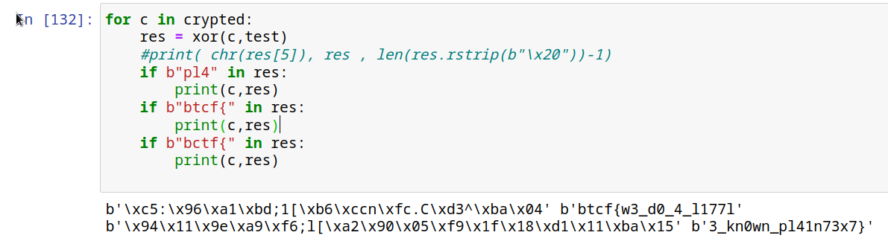

# Real Smooth

I know you're not supposed to leave passwords in plain text so I encrypted them.

[database.txt](https://mega.nz/file/RbFmnQ4D#VndwF8RUGNS0H52FJHcfYNCGvL5JzLCMsPhvbjVfR9Y)

## Chacha20 - Nonce attack

```
Si nonce+key = même flot :
	encrypt(A1) = B1
	encrypt(A2) = B2 
	xor(A1,A2) = xor(B1,b2)




