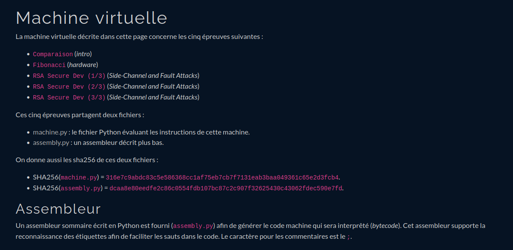

## Tableau de mes résolutions

Voir notamment `rsa` dans `side_chan`.

| **Welcome** | Résolu |
| ------ | -------- |
|  | :x: |
| ------ | -------- |
| **Misc** | Résolu |
| ------ | -------- |
|  | :white_check_mark:  |
| [Zéro pointé](https://ofenomeno.xyz/FR-FCSC2023-Zero-Pointe-WriteUp)  | :x:  |
| [Des p'tits trous](https://fcsc2023.noderyos.dev/des_p_tits_trous) | :x:  |
| La base | :x:  |
| [Rechatdrage](https://github.com/StroppaFR/CTF-Writeups/tree/master/2023/FCSC2023/misc/Rechatdrage) | :x: |
| [Evil Plant](https://github.com/lionelmarcus10/CTF/blob/main/EVILPLANT.md) | :x:  |
| [Rouge saumon](https://bluesheet.fr/article/6) | :x:  |
| The Colour of Magic | :x:  |
| [Mauvaise baleine](./misc/mauvaise_baleine) | :x:  |
| ------ | -------- |
| **Side channel** | Résolu |
|  | :heavy_check_mark:  |
|  | :heavy_check_mark:  |
|  | :heavy_check_mark:  |
|  | :x:  |
|  | :x:  |
| ------ | -------- |
| **Reverse** | Résolu |
|   | :x:  |
| [chaussette (XS)](https://trikkss.github.io/posts/fcsc2023_chaussette-xs/) | :x:  |
| chaussette  | :x:  |
| [Sensor Watch](https://trikkss.github.io/posts/fcsc2023_Sensor-Watch/) | :x:  |
| [Brachiosaure](https://github.com/StroppaFR/CTF-Writeups/tree/master/2023/FCSC2023/reverse/Brachiosaure) | :x:  |
| [Contrôleur de licence](https://redoste.xyz/2023/04/30/write-up-fcsc-2023-contr%C3%B4leur-de-licence/) | :x:  |
| [Picasso](https://ctf.0xff.re/2023/fcsc-2023/picasso) | :x:  |
| [Video Games Awards](https://redoste.xyz/2023/04/30/write-up-fcsc-2023-video-games-awards/) | :x:  |
| [Hola Amigo](https://ctf.0xff.re/2023/fcsc-2023/hola-amigo) | :x:  |
| ------ | -------- |
| **Crypto** | Résolu |
|   | :x:  |
| [Elliptic Addrenaline](./crypto/elliptic_adventure/) | :x:  |
| [Le hash qui rit](https://github.com/htmb-bot/CTF/blob/main/Lehashquirit.md)  | :x:  |
| [Cry Me a River](https://github.com/arusson/fcsc2023-write-up) | :x:  |
| Pain in the Hash | :x:  |
| Niagara | :x:  |
| [Grabin](https://github.com/AZ-0/Writeups/blob/main/2023/fcsc/crypto-grabin/writeup.md) | :x:  |
| [Black Block](https://github.com/AugustinBariant/Write-ups/tree/master/FCSC2023/Black%20Block) | :x:  |
| ------ | -------- |
| **Forensic** | Résolu |
|   | :heavy_check_mark:  |
| [Ransomémoire 1,2,3/3](https://blog.itarow.xyz/posts/ransomemoire/) | :x: |
|  | :heavy_check_mark:  |
| [APT Style 1-7/7](https://github.com/21repierre/FCSC-2023/tree/master/forensics/APT)  | :x:  |
| Sadmind | :x:  |
| [Baleine sous graviers](https://blog.itarow.xyz/posts/baleine_sous_graviers/) | :x:  |
| ------ | -------- |
| **Hardware** | Résolu |
| [canflag](https://kktus.gitlab.io/writeups/fcsc-2023/canflag/)  | :x:  |
|  | :heavy_check_mark:  |
| [Au Boolot](https://kktus.gitlab.io/writeups/fcsc-2023/au-boolot/)  | :x:  |
| [keypadbol](https://fcsc2023.noderyos.dev/keypadbol) | :x:  |
| [PALeoTV](https://github.com/loulous24/FCSC/blob/master/FCSC2023/PALeoTV.md) | :x:  |
| [Sous marin](https://github.com/loulous24/FCSC/blob/master/FCSC2023/Sous_marin.md) | :x:  |
| ------ | -------- |
| **Pwn** | Résolu |
| [robot](https://github.com/themaskott/fcsc_2023/tree/main/pwn/robot)  | :x:  |
| [Ptérodactyle](https://github.com/themaskott/fcsc_2023/tree/main/pwn/pterodactyle) | :x:  |
| [May the Forth](https://github.com/GammaRay99/CTF-WRITEUPS/tree/main/FCSC2023/pwn/may_the_forth)  | :x:  |
| [May the Fifth](https://www.numb3rs.re/writeup/fcsc2023_maythefifth/) | :x:  |
| [pwnduino](https://www.numb3rs.re/writeup/fcsc2023_pwnduino/) | :x:  |
| [Keskidi](https://github.com/themaskott/fcsc_2023/tree/main/pwn/keskidi) | :x:  |
| [HTTP 2](https://github.com/voydstack/FCSC2023/blob/main/http2/HTTP%202.md) | :x: |
| [ktruc](https://github.com/voydstack/FCSC2023/blob/main/ktruc/ktruc.md) | :x: |
| ------ | -------- |
| **Web** | Résolu |
|   | :x:  |
|  | :heavy_check_mark:  |
| [ENISA Flag Store 2/2](./web/enisa)  | :white_check_mark:  |
| [Hello from the inside](https://keyzen.net/posts/fcsc/2023/web/hellofromtheinside/) | :x:  |
| [Tweedle Dum](https://thbz.fr/posts/fcsc-2023-tweedle-dum/) | :x:  |
|  | :x:  |
| [Follow the Rabbit](https://naacbin.gitlab.io/follow-the-rabbit/) | :x: |
| [Tweedle Dee](https://vozec.fr/writeups/tweedle-dum-dee/) | :x: |
| [Whiskers in the Dark](https://mizu.re/post/whiskers-in-the-dark) | :x: |
| ------ | -------- |
| **Intro** | Résolu |
|   | :heavy_check_mark:  |
| [Dystylosaurus](https://fcsc2023.noderyos.dev/dystylosaurus) | :x:  |
|   | :heavy_check_mark:  |
|  | :heavy_check_mark:  |
| [SPAnosaurus](./intro/spanausorus) | :x:  |
|  | :heavy_check_mark:  |
|  | :heavy_check_mark: |
|  | :heavy_check_mark: |
|  | :heavy_check_mark: |

:white_check_mark: : refait après coup

## Challenges utilisant la machine virtuelle

