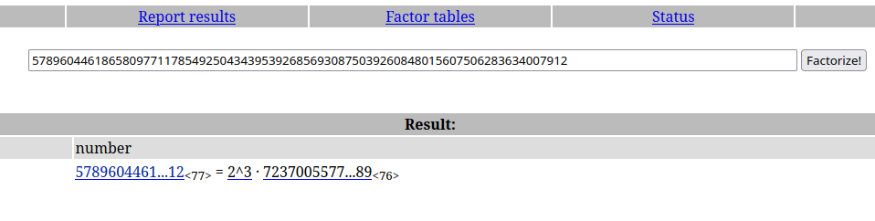

# Points - Refait à partir du compte rendu (Poustouflan)


Deux autres points A et B sont présents sur une courbe elliptique d’équation $$(E) : y2 = x3 + ax + b[p]$$

Dans le fichier `output.txt`, les coordonnées des points A + B et A − B sont indiqués. L’objectif est de retrouver les coordonnées des points A et B, qui chiffrent le flag.

## Inverser

On se sert de 2 propriétés:

- E est un groupe **cyclique**
- L’**ordre** de (E) , k, est un nombre **non premier**

En effet:

```python
from sage.all import *

p = 2**255 - 19
a = 19298681539552699237261830834781317975544997444273427339909597334573241639236
b = 55751746669818908907645289078257140818241103727901012315294400837956729358436

K = GF(p)
E = EllipticCurve([K(a), K(b)])
ordre = E.order() # 57896044618658097711785492504343953926856930875039260848015607506283634007912
```



k//8 est premier donc son inverse h vérifie $$2h = 1+ k//8$$

## Retrouver A et B:

Pour trouver les bytes correspondant à chaque moitié de flag, on peut `multiplier les points par l'inverse du groupe`.

$$(2.A).h = A.(2.h) = A.(k + 1) = A.k + A = A$$


```python
from Crypto.Util.number import long_to_bytes
from sage.all import *

p = 2**255 - 19
a = 19298681539552699237261830834781317975544997444273427339909597334573241639236
b = 55751746669818908907645289078257140818241103727901012315294400837956729358436

K = GF(p)
E = EllipticCurve([K(a), K(b)])

G = E(17794503229134353635970439812949297100225489487588172568389327897754746546280, 17671033459111968710988296061676524036652749365424210951665329683594356030064) #E.gens()

A_plus_B = E(36383477447355227427363222958872178861271407378911499344076860614964920782192, 26621351750863883655273158873320913584591963316330338897549941610801666281894)
A_minus_B = E(35017143636654127615837925410012912090234292410137109973033835965781971515338, 55888666729705323990488128732989325970476008697224551268788692630541877244410)

aa = A_plus_B + A_minus_B #2A
bb = A_plus_B - A_minus_B #2B

k = E.order()//8 #premier
h = (k + 1) // 2 #inverse de k dans E (modulo 2)

number = 8

for r in range(number):
        A = aa*h - G*k*r
        if A + A == aa:
                partie = long_to_bytes(int(A[0]))
                if partie.startswith(b"FCSC{"):
                        print(partie.decode(), end = '')
                        break

for r in range(number):
        B = bb*h - G*k*r 
        if B + B == bb:
                partie = long_to_bytes(int(B[0]))
                if partie.endswith(b"}"):
                        print(partie.decode())
                        break
```

