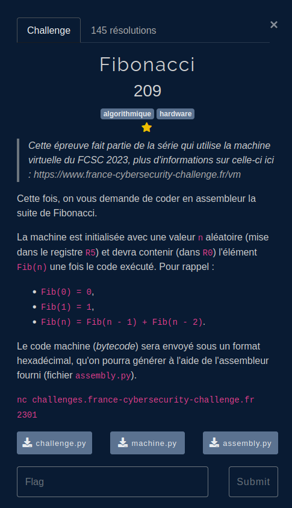

## Enonce

Voir le challenge  pour la description/ compréhension du fonctionnement de la machine virtuelle.



## Résolution

Voici une solution à compiler avec comp.py:

```asm
; Initialisation des registres
MOV R0, #0      ; Initialisation de R0 à 0
MOV R1, #1      ; Initialisation de R1 à 1
MOV R2, #0      ; Initialisation de R2 à 0
MOV R3, #0      ; Initialisation de R3 à 0
MOV R4, #1      ; Initialisation de R4 à 1

; Si n est égal à 0, on retourne 0
CMP R5, R0
JZA END

; Si n est égal à 1, on retourne 1
CMP R5, R1
MOV R0, #1
JZA END

FIB_LOOP:
    ADD R0, R1, R2  ; R0 = R1 + R2 F(n) = F(n-1) + F(n-2)
    MOV R1, R2  ; R2 = R1 F(n-2)=F(n-1)
    MOV R2, R0  ; R1 = R0 F(n-1)=F(n)
    ADD R3, R3, R4  ; Incrémentation du compteur
    CMP R3, R5
    JZA END
    CMP R0,R0
    JA FIB_LOOP ; le compteur est  < à n, on continue la boucle

; Fin du programme

END:
STP
```
La subtilité réside dans la gestion des sauts (JZA si = est vrai, JA pour un simple saut boucle ou section), ainsi qu'à l'ordre des affectations dans le corps de boucle.


