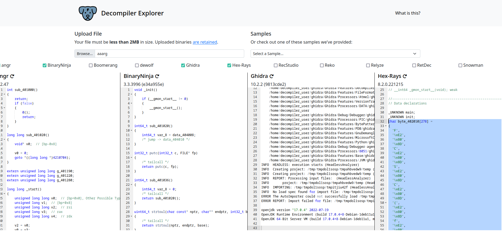

## AAARG

On a un petit binaire 64 bits à reverse.
On va sur https://dogbolt.org/:

Il faut ensuite faire une petite boucle à coup de `chr` et de `''.join()` en python.
Et on découvre le flag en ascii:

`FCSC{f9a38adace9dda3a9ae53e7aec180c5a73dbb7c364fe137fc6721d7997c54e8d}`
