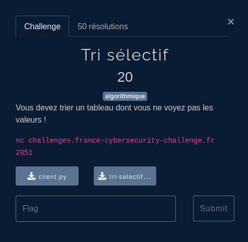
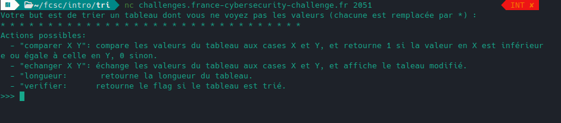
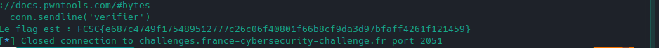

## Challenge



## Enonce

On se connecte avec `netcat`. Nous allons devoir trier un tableau en n'ayant accès qu'à ces 3 fonctions.




## Résolution

J'ai utilisé `pwntools`.

```python
from pwn import *

conn = remote('challenges.france-cybersecurity-challenge.fr', 2051)

# Récupérer la longueur du tableau
conn.recvuntil('>>> ')
conn.sendline('longueur')
longueur = int(conn.recvline().decode().strip())

# Boucle pour trier le tableau
tri_effectue = False
while not tri_effectue:
    tri_effectue = True
    for i in range(longueur-1):
        conn.recvuntil('>>> ')
        # Comparer les éléments i et i+1
        conn.sendline(f'comparer {i} {i+1}')
        res = int(conn.recvline().decode().strip())
        if res == 0: # Si i > i+1
            # Echanger les éléments i et i+1
            conn.recvuntil('>>> ')
            conn.sendline(f'echanger {i} {i+1}')
            conn.recvuntil('>>> ')
            conn.sendline('afficher')
            tri_effectue = False # Un échange a été effectué, donc on doit continuer de trier

# Vérifier si le tableau est trié
conn.recvuntil('>>> ')
conn.sendline('verifier')
flag = conn.recvline().decode().strip()
print(flag)
```


