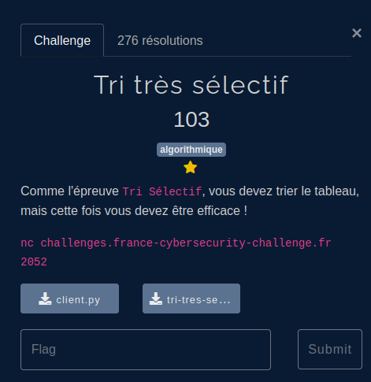
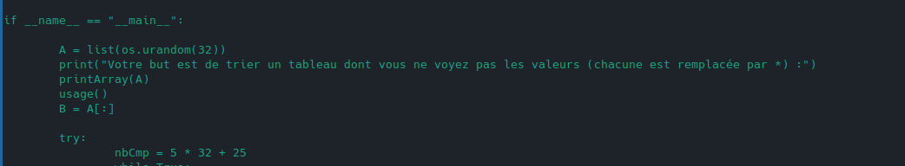
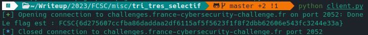

## Énoncé



Même chose que dans [tri](../../intro/tri) mais les comparaisons sont limitées:



## Résolution

**Quicksort**:

```python
#!/usr/bin/env python3

# python3 -m pip install pwntools
from pwn import *

# Paramètres de connexion
HOST, PORT = "challenges.france-cybersecurity-challenge.fr", 2052

def comparer(x, y):
        io.sendlineafter(b">>> ", f"comparer {x} {y}".encode())
        return int(io.recvline().strip().decode())

def echanger(x, y):
        io.sendlineafter(b">>> ", f"echanger {x} {y}".encode())

def longueur():
        io.sendlineafter(b">>> ", b"longueur")
        return int(io.recvline().strip().decode())

def verifier():
        io.sendlineafter(b">>> ", b"verifier")
        r = io.recvline().strip().decode()
        if "flag" in r:
                print(r)
        else:
                print(io.recvline().strip().decode())
                print(io.recvline().strip().decode())

def trier(N):
    # Tri par sélection
    for i in range(N-1):
        # Recherche de l'élément minimum dans le sous-tableau non trié
        min_idx = i
        for j in range(i+1, N):
            if comparer(j, min_idx):
                min_idx = j
        # Échange de l'élément minimum avec l'élément en première position du sous-tableau non trié
        if min_idx != i:
            echanger(i, min_idx)

# Ouvre la connexion au serveur
io = remote(HOST, PORT)

# Récupère la longueur du tableau
N = longueur()

# Appel de la fonction de tri que vous devez écrire
trier(N)

# Verification
verifier()

# Fermeture de la connexion
io.close()
```

La complexité temporelle du tri rapide est en moyenne O(n log n) et dans le pire des cas O(n^2).

