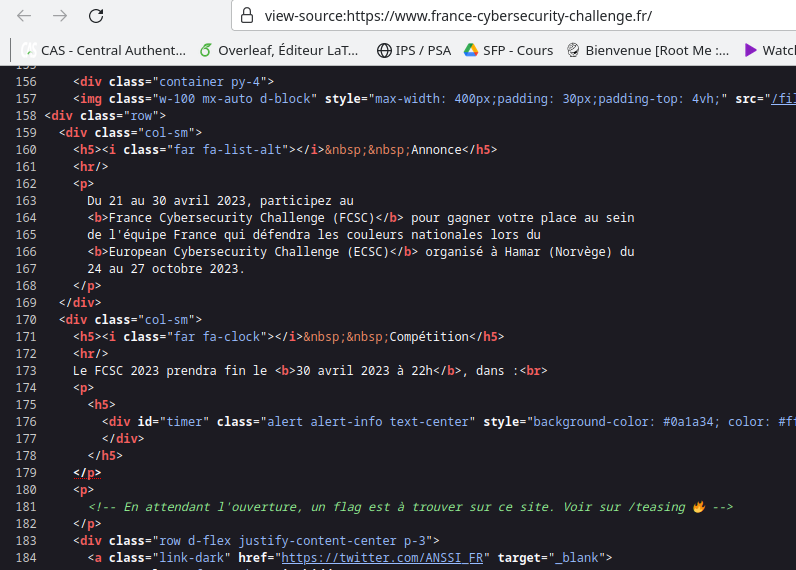
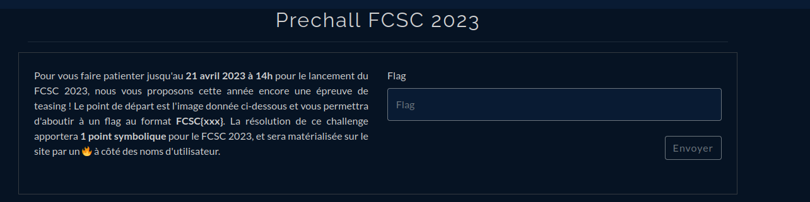
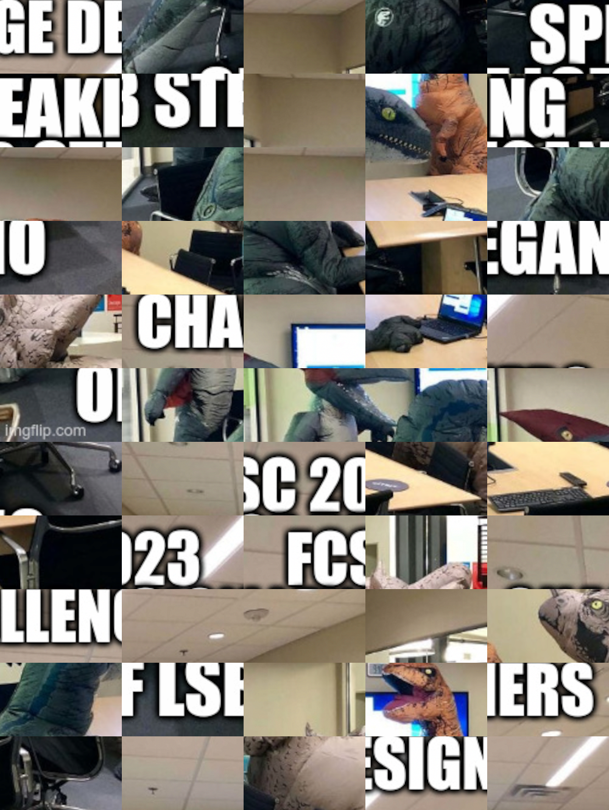
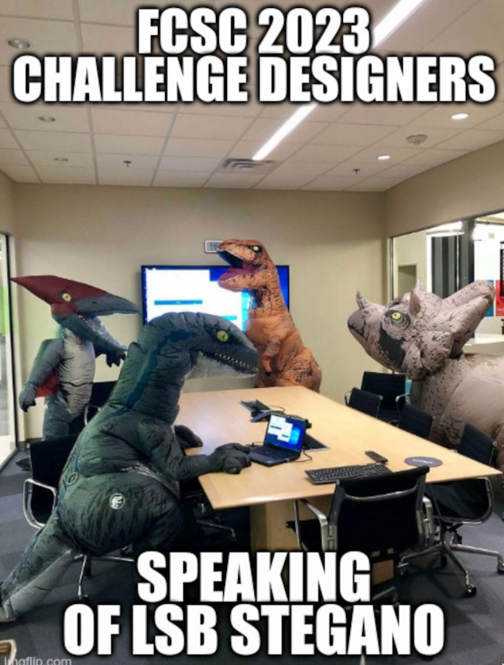

# Trouver le chall

# Puzzle

Il faut d'abord résoudre ce puzzle de 55 blocs par 11

On peut remettre en ordre en utilisant un tool (ChatGPT, Github) ou à la main en découpant, numérotant ...

# LSB:

Flemme
