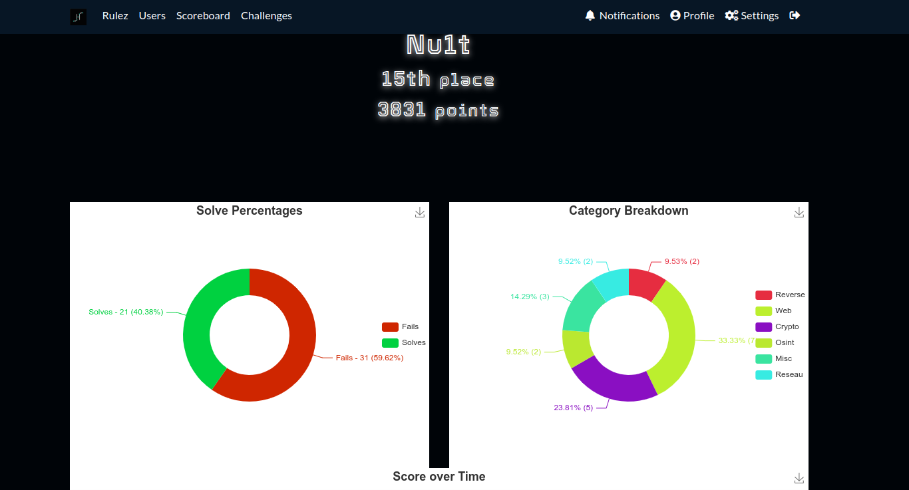
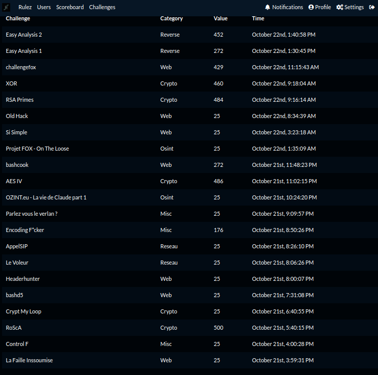
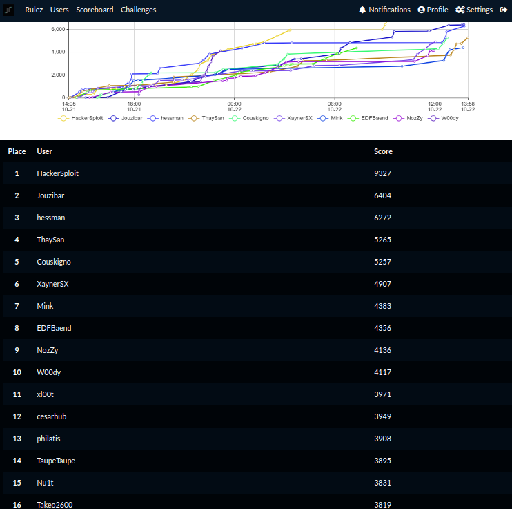

## Flag4all

`Non résolus`

- [Realiste/GishaDB](https://nozyzy.github.io/posts/gishadb/)
- [Forensic/Wildcard CA, Prog/{Shortpath,Bashcat}, Realiste/DevOops, Web/GuessMe](https://github.com/Baend/Writeup/tree/main/2023/flag4all)

