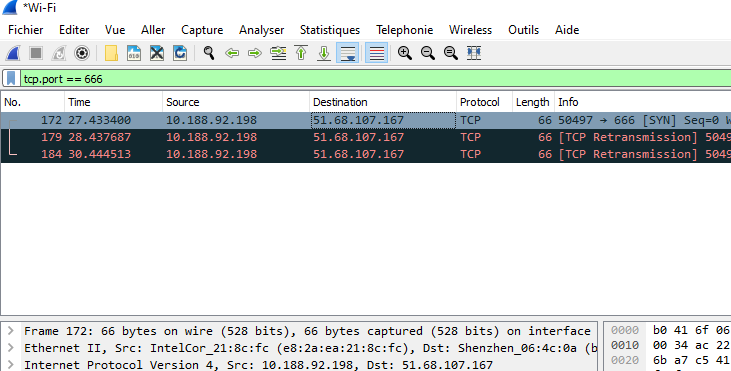

# Auteur

`K_lfa (BZHack / ESDAcademy)`

## Methode 1 (non effective)

```bash
strace -f -e trace=network -s 10000 wine chall.exe  &>strace.out`
```

```bash
grep connect strace.out
```

On remarque des connections avec le module `socket` de Python mais rien de probant

## Methode 2

- Lancer `chall.exe`

- Lance `wireshark` (admin/root)



`FLAG{bzhack.bzh:666}`
