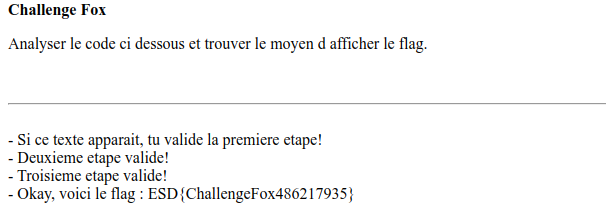

# Enonce : original.php

## Etape0

Desobfuquer le code [ici](https://www.unphp.net/), output dans `index.php`

## Etape1

```php
if ($variable === "challengefox") {
    echo "- Si ce texte apparaît, tu valides la première étape! <br>";
```

il suffit de soumettre `challengechallengefoxfox`

## Etape 2

La plus méconnue imho. En googlant la fonction:

```php
if (preg_match("/ |_/", $query))
```

https://ctftime.org/writeup/11535

On apprend que `.` est un **équivalent** à `_`, du coup on peut soumettre:

`challenge.fox`

## Etape2

L'idée pour cette étape et la suivante est la **loose comparison** `0 == 0e123 == 0e321`

```php
if (hash("md2", $_GET["variable2"]) == "0")
```

On cherche un `magic hash` pour `md2`, en voici quelques-uns: https://github.com/spaze/hashes/blob/master/md2.md

## Etape3

Pareil mais il faut que le hash soit égal au message (`==0` pour plus de simplicité :p)

```php
if (hash("sha1", $_GET["variable3"]) == $_GET["variable3"])
```

[Voir également](https://github.com/spaze/hashes/blob/master/sha1.md)

## Sol

https://fox.flag4all.sh/?variable=challengechallengefoxfox&challenge.fox=z&variable2=3dAHjEEvaWhd&variable3=0e00000000000000000000081614617300000000


