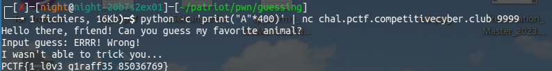

# Guessing Game

## Ghidra

`main`

```c
undefined8 main(void)

{
  puts("Hello there, friend! Can you guess my favorite animal?");
  check();
  return 0;
}
```

`check`

```c
void check(void)

{
  int iVar1;
  undefined8 local_140;
  char local_138 [300];
  int local_c;
  
  local_140 = 0x65666661726947;
  local_c = 0;
  printf("Input guess: ");
  gets(local_138);
  iVar1 = strcmp(local_138,(char *)&local_140);
  if (iVar1 == 0) {
    puts("That\'s not my favorite animal... I promise!");
  }
  else {
    puts("ERRR! Wrong!");
  }
  if (local_c != 0) {
    puts("I wasn\'t able to trick you...");
    outputFlag();
  }
  return;
}
```

On cherche donc à overflow local_138 pour changer la valeur de local_c, on fournit donc plus de 300 bytes:


