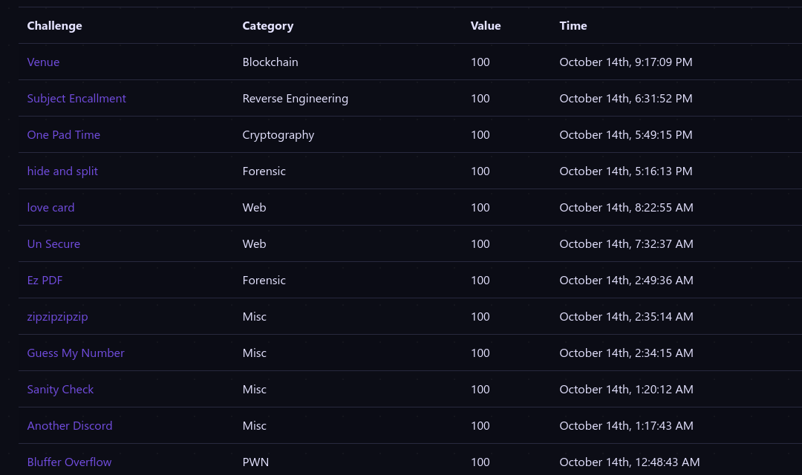

## TCP1P ctf

https://github.com/TCP1P/TCP1P-CTF-2023-Challenges/tree/main

### Memo

- `forensic/hide_and_split` (EA /ADS mount in NTFS)

- `misc/guess_my_number` (PRNG)

- `misc/another_discord` 
	- [Selfbot ToS Discord -> risque de ban](https://support.discord.com/hc/en-us/articles/115002192352-Automated-user-accounts-self-bots-)
	- [Discord API](https://github.com/TCP1P/TCP1P-CTF-2023-Challenges/tree/main/Misc/Another%20Discord/writeup)

- `reverse/take_your_byte` (bytecode python + z3)

- `pwn/babyheap` (uaf)

- `crypto/one_pad_time` (aes cbc iv)

- `crypto/open_the_noor` [padding oracle cbc]()

- `web/bypass` [fragmented sqli](https://www.invicti.com/blog/web-security/fragmented-sql-injection-attacks/)

- `web/latex`

- `web/unsecure` (php deserialization)

- `web/pdfify` (sqli || ssrf || cve)

**Check web / pwn / crypto**

*Check catégorie Mobile*

