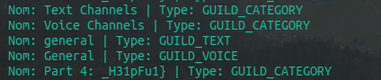

# Avoir le flag 🚩

Une fois arrivé sur le nouveau discord sur ce lien la: "https://discord.gg/kzrryCUutP"

## Part 1

Nous avons un channel vocal, avec les nouvelles mises a jour de discord nous avons maintenant des channels textes dans les challenges vocaux, le premier flag y est :)

Part 1: TCP1P{d15c0RD_

## Part 2

Il y a longtemps que je connais cette faille discord très très peu connu je vous explique le principe:

Enfaite quand nous avons un serveur discord, vu que nous avons des roles et que discord gère très bien les membres, roles etc...

Dans **tout** les serveurs, enfaites les channels et les roles sont visible par **tout les monde**, c'est l'application elle même qui n'affiche pas ces informations mais pourtant elles sont belle est bien la, nous avons donc à crée un selfbot pour avoir ses salons. J'ai pris mon selfbot pour cela `https://github.com/MisTraleuh/Selfbot-Discord` j'ai modifier le main comme cela:

`start.js`

```js
client.on('messageCreate', async message => {
  if (message.content === '1154468492259627008') { // que le serveur du challenge
    if (message.guild) { // éviter les crash
      const channels = message.guild.channels.cache; // On récupère tout les channels stocké dans le cache comme vu précédement
      channels.forEach(channel => { // on boucle sur les channels
        console.log(`ID: ${channel.id} | Nom: ${channel.name} | Type: ${channel.type}`); // on les affiches
      });
    }
  }
});
```

on trouve alors ce channel: `Part 2 : d0cUM3n74710n_W`

## Part 3

On trouve la partie trois dans la description de l'évènement discord: `PART 3 45_r341ly`

## Part 4

C'est exactement comme la partie 2 mais pour les roles:

`start.js`

```js
client.on('messageCreate', async message => {
  if (message.guild.id == "1154468492259627008") { // que le serveur du challenge
    const roles = message.guild.roles.cache // On récupère tout les roles stocké dans le cache comme vu précédement
    roles.forEach(role => { // on boucle dessus 
      console.log(`ID du rôle: ${role.id} | Nom du rôle: ${role.name} | Couleur: ${role.hexColor}`); // on les affiche
    });
  }
  if (message.author.id !== client.user.id) return
})
```

Et nous avons la part 4 `H31pFu1}`

# Flag

Bravo au créateur du challenge d'avoir un QI négatif puisque le flag est `TCP1P{d15c0RD_d0cUM3n74710n_W45_r341ly_H31pFu1}` avec un `_` oublié. SU-PER

## Memo

- le *selfbot* permet de voir le contenu des channels cachés avec `message.guild.id`

- il faut qu'un autre user join pour voir les résultats dans la console


