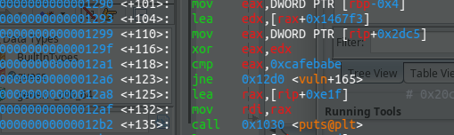

## Ghidra / gdb

** but = retrouver key**

`vuln`

```c
void vuln(void)

{
  int iVar1;
  
  key = 0;
  srand(0x539);
  iVar1 = rand();
  printf("Your Guess : ");
  fflush(stdout);
  __isoc99_scanf(&DAT_001020cb,&key);
  if ((key ^ iVar1 + 0x1467f3U) == 0xcafebabe) {
    puts("Correct! This is your flag :");
    system("cat flag.txt");
                    /* WARNING: Subroutine does not return */
    exit(0);
  }
  puts("Wrong, Try again harder!");
  return;
}
```

### Break rand (iVar1)

On casse rand avec 

```c
#include <unistd.h>
#include <stdio.h>

int main(void)
{
    srand(1337, 1, 1, 0x7ffbd62bfa77);
    int a = rand(0xffffffff, 0x7ffbd63c4860, 0x7ffbd63c4204, 0x7ffbd63c4280)    ;
    printf("%d\n", a);
}
```

** iVar1 = 292616681 (= rand())**

### Obtenir addresse 0x1467f3U



### Cafebabe -> get key

`0xcafebabe == 3405691582`

On retrouve la clé

```c
#include <stdlib.h>
#include <stdio.h>

int main(){
        srand(0x539);
        int iVar1 = rand();
        int key = 0xcafebabe ^ (iVar1 + 0x1467f3U);
        printf("%d", key);
}
```

```bash
┌─[night@night-20b7s2ex01]─[~/tcpip/misc/guess_my_number]
└──╼ 8 fichiers, 124Kb)─$ echo $(./solve) | ./guess 
=======              WELCOME TO GUESSING GAME               =======
======= IF YOU CAN GUESS MY NUMBER, I'LL GIVE YOU THE FLAG  =======

Your Guess : Correct! This is your flag :
flag
```
