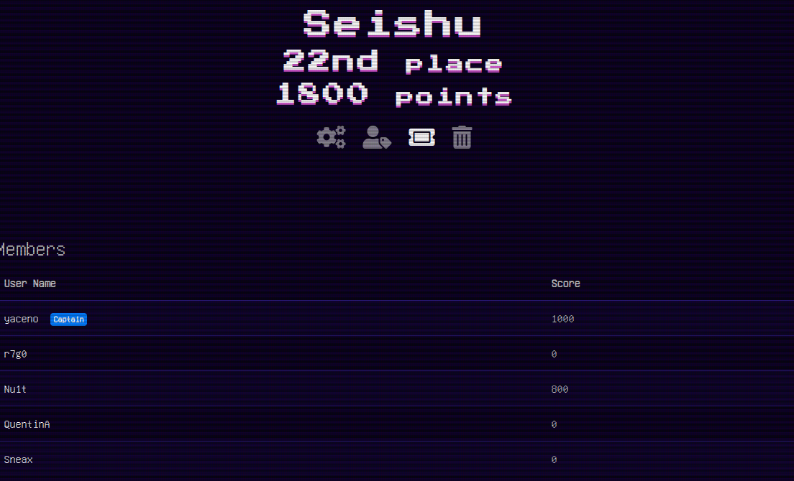

# ZiTF CTF 2023 (11 mars, 9h00 à 18h00)

## Solution des challenges

Note pour moi même:

Crypto: https://stackoverflow.com/questions/8504882/searching-for-a-way-to-do-bitwise-xor-on-images ...
Stegano:  
CVE/RedTeam: https://vulmon.com/searchpage?q=CTFd
