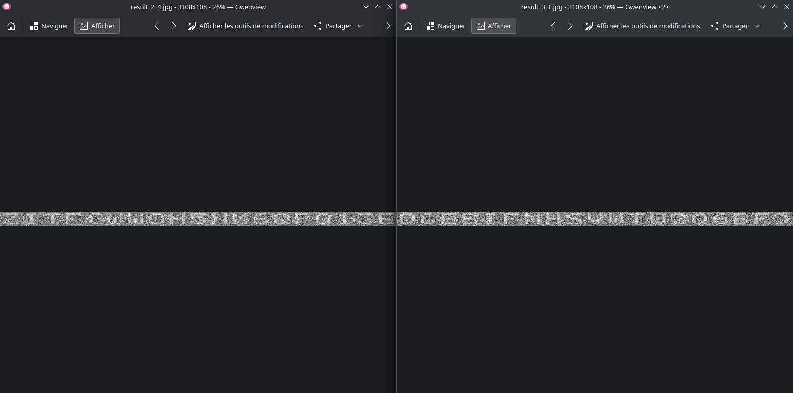

# Mysterious Picture

## Xor all

On dispose de 4 images pour ce challenge. En observant les variations de gris on peut penser à un Xor entre chaque image.
Une image étant un tableau de pixels  [R,G,B] (8 bits chacun), on s'attend en effet à des nuances grisées.

Une première idée est de tout xorer:

```python
from PIL import Image
import numpy as np

img1 = np.array(Image.open("proboscis_monkey.png"))
img2 = np.array(Image.open("spider_monkey.png"))
img3 = np.array(Image.open("vervet_monkey.png"))
img4 = np.array(Image.open("squirrel_monkey.png"))

# XOR des 4 tableaux
result = np.bitwise_xor(img1, img2)
result = np.bitwise_xor(result, img3)
result = np.bitwise_xor(result, img4)

# Conversion en mode RVB
result_image = Image.fromarray(result.astype('uint8')).convert('RGB')
result_image.save("result.jpg")
```

Mais le résultat indique que le flag sera simplement le xor de 2 images:


## Xor 2

On test alors toutes les combinaisons:

```python
from PIL import Image
import numpy as np

img1 = np.array(Image.open("proboscis_monkey.png"))
img2 = np.array(Image.open("spider_monkey.png"))
img3 = np.array(Image.open("vervet_monkey.png"))
img4 = np.array(Image.open("squirrel_monkey.png"))

for i in range(1,5):
        for j in range(1,5):
                result = np.bitwise_xor(eval(f'img{i}'), eval(f'img{j}'))
                result_image = Image.fromarray(result.astype('uint8')).convert('RGB')
                result_image.save(f"result_{i}_{j}.jpg")
```

On constate que 4 images (donc 2 combinaisons sur 8) produisent une partie du flag.
(le Xor étant symétrique, on a result_i_j.png = result_j_i.png)

On peut concaténer le résultat du xor de 2 avec 4 et 1 avec 3:


