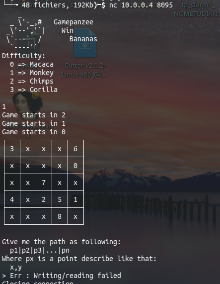

# But

Le flag était réparti entre les 4 niveaux de difficultés suivants, avec la même consigne:

Tentative de résolution dans le premier .py (avec erreurs, dont inversion des y,x )

Voir https://github.com/Walbre/zitf-2023
