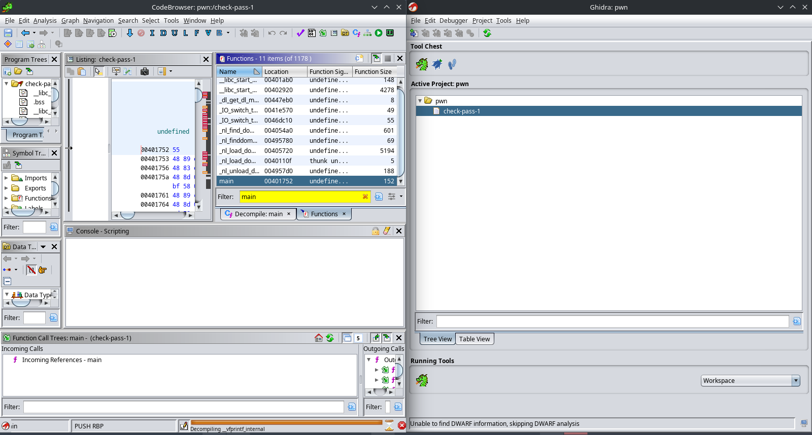
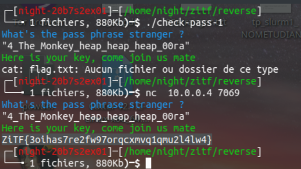
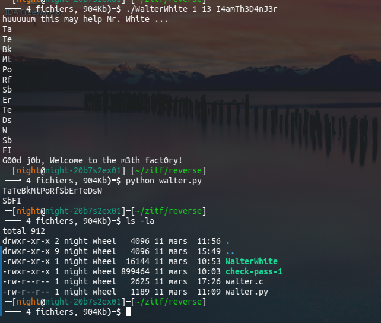

# Reverse

## Nu1t

## March 2023

## 1 Check Pass 1

Pour ce challenge on peut utiliser Ghidra.



Dans la liste des fonctions, on regarde en priorité main.
undefined8 main(void)

```c
{
int iVar1;
long lVar2;
undefined *puStack_60;
undefined auStack_58 [32];
undefined auStack_38 [48];

printf (& UNK_004970b0 ,&Blue ,& Reset);
lVar2 = fgets(auStack_38 ,0x2d ,_IO_2_1_stdin_ );
if (lVar2 != 0) {
iVar1 = __isoc99_sscanf(auStack_38 ,& UNK_004970d7 ,auStack_58 );

if (iVar1 == 1) {
puStack_60 = auStack_58;
tricky_move (& puStack_60 );
check_pass(puStack_60 );
}

return 0;
}
```

La fonction checkpass nous interpelle, allons la regarder de plus près:

```c

void check_pass(char *param_1)

{
  int iVar1;
  
  iVar1 = strncmp(param_1,"4_The_Monkey_heap_heap_heap_00ra",0x20);
  if (iVar1 == 0) {
    printf("%sHere is your key, come join us mate%s\n",&Green,&Reset);
    system("cat flag.txt");
  }
  else {
    printf("%sur not one of us stupid human%s\n",&Red,&Reset);
  }
  return;
}
```

On découvre donc une comparaison avec le mot de passe, qui affiche en fait le flag du challenge si
le mot de passe est correct. On se connecte donc en TCP avec netcat au challenge:



C’est dans la poche!


## 2 WalterWhite

Pour ce challenge, Ghidra me donnant un code plutôt verbeux et compliqu é j’ai opt é pour hexrays.
(comparaison avec l’outil https://dogbolt.org/)

Plusieurs ́éléments nous interpellent. Premièrement la comparaison du pass à une chaîne de car-
actère en ascii. Si chaque caractère est correct, la variable booléenne donne lieu à un succès:

```c

if ( v7 == strlen(s) )
{
puts("huuuuum this may help Mr. White ...");
for ( i = 0; i <= 37; ++i )
putchar(c[i]);
}
if ( argc == 4 )
{
v5 = 1;
for ( j = 0; j <= 12 && v5; ++j )
{
if ( argv [3][j] != v8[j] )
v5 = 0;
}
if ( v5 )
puts("G00d j0b , Welcome to the m3th fact0ry!");
else
puts("well well well ... not quite yet!");
}
```

Ensuite, on se rend compte que le programme attend en réalité 3 arguments: un entier 1 , un entier
v7 devant être  égal à strlen(s) ainsi que la chaîne de caractère correspondant au pass. Ici on se rend
compte que cette chaîne est v8 est mesure 13 = strlen(s) caractères.

```c

if ( atoi(argv [1]) == 1 )
{
v7 = atoi(argv [2]);
memset(v8, 0, 0xC8uLL );
v8[0] = 73;
v8[1] = 52;
v8[2] = 97;
v8[3] = 109;
v8[4] = 84;
v8[5] = 104;
v8[6] = 51;
v8[7] = 68;
v8[8] = 52;
v8[9] = 110;
v8[10] = 74;
v8[11] = 51;
v8[12] = 114;
```

Il suffit alors de traduire la chaîne en ascii

```python

v8 = [73 ,52 ,97 ,109 ,84 ,104 ,51 ,68 ,52 ,110 ,74 ,51 ,114]
flag = ""

for i in range(len(v8)):
  flag += chr(v8[i])

print(flag)
```

Ce qui donne le pass I4amTh3D4nJ3r
On vérifie!



Le flag est doncZiTF{I4amTh3D4nJ3r}

## 3 Bansky

https://github.com/LighTend3r/Writeup/blob/main/2023/ZiTF/Reverse/Banksy.md
