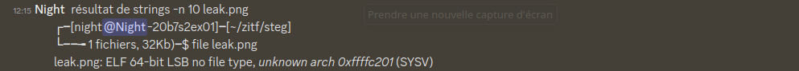
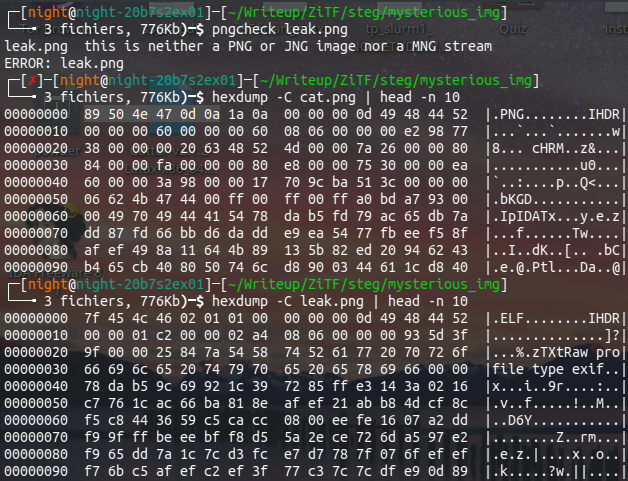
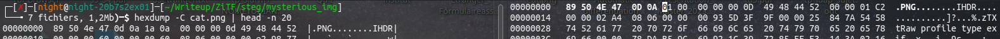
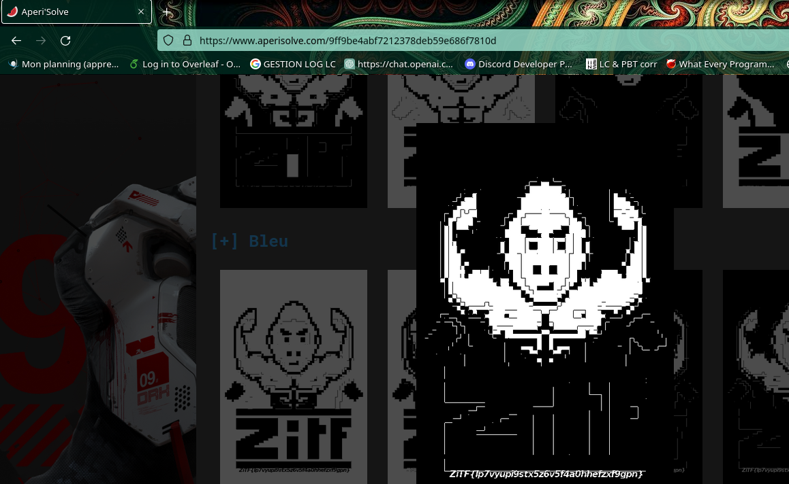

## Pngcheck

J'aurais dû m'en rendre compte plus tôt. Surtout qu'on voit avec strings qu'on a une image éditée avec GIMP. 
Pngcheck est un outil classique permettant de vérifier qu'une image a été corrompue et de vérifier les CHUNKs de celle -ci.

En effet une image est définit par des "chunks" (IEND, IDATA par exemple) et une *signature*.
Et effectivement celle - ci a été éditée en une signature d'un éxécutable ELF.
Voir:

http://www.libpng.org/pub/png/spec/1.2/PNG-Chunks.html

On peut vérifier ceci en comparant la signature avec une image valide:

## Hexedit

Il suffit d'utiliser cet héditeur pour obtenir une image leak.png valide à droite:

## Aperisolve

Pour distinguer le flag à peine visible, on peut utiliser l'outil de ctf Aperisolve (qui lance pas mal de vérifications intéressantes en stega)

