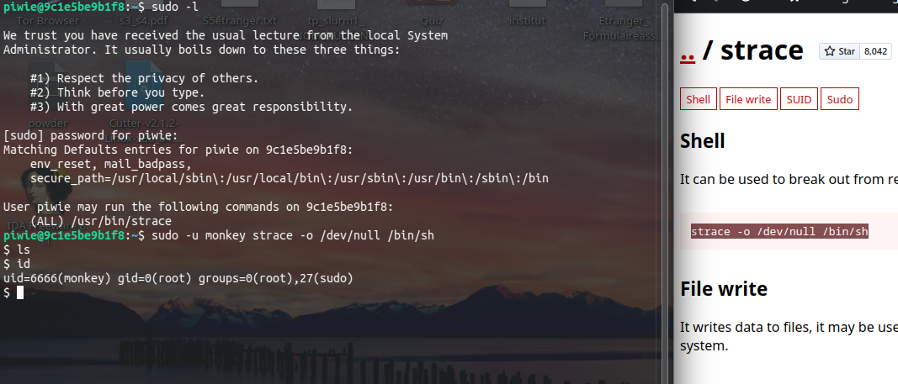
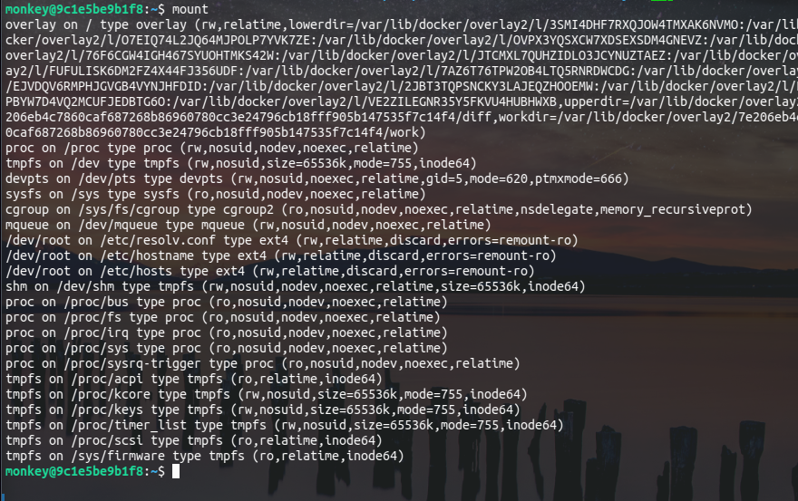

# Notes 

## Binaire SUID

On devient alors l'administrateur monkey. On a l'id root mais c'est tout.

## Esacpe Docker

On découvre alors qu'on est dans un docker.

## Linpeas

On peut essayer de scp différents binaires mais je ne suis pas allé plus loin.
