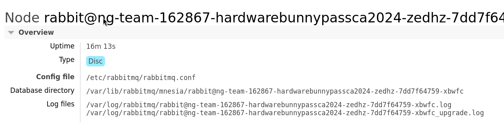
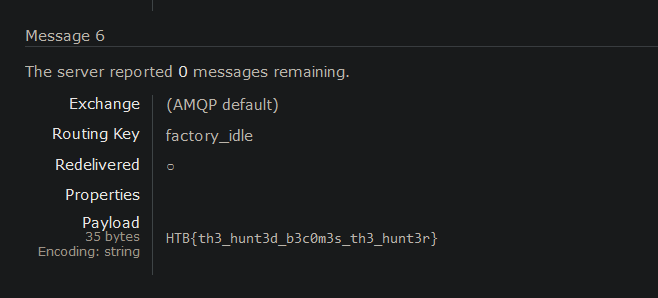

## Enonce

As you discovered in the PDF, the production factory of the game is revealed. This factory manufactures all the hardware devices and custom silicon chips (of common components) that The Fray uses to create sensors, drones, and various other items for the games. Upon arriving at the factory, you scan the networks and come across a RabbitMQ instance. It appears that default credentials will work.

## RabbitMQ

On arrive ici = système de discussion impliquant producer/subscriber en cluster. 

On se connecte avec `guest:guest`.
Il faut se souscrire à la `zeromqueue` et vérifier si l'on reçoit le flag en message.

Il ya 6 messages dans cette queue http://94.237.52.91:36212/#/queues/%2F/factory_idle .
On effecture alors un `getMessage -> 6` (action destructrice):

