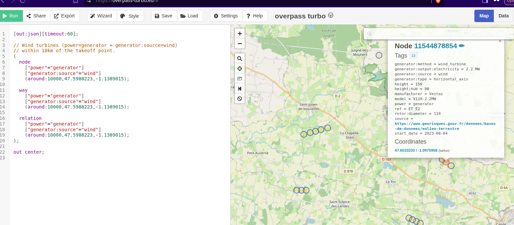
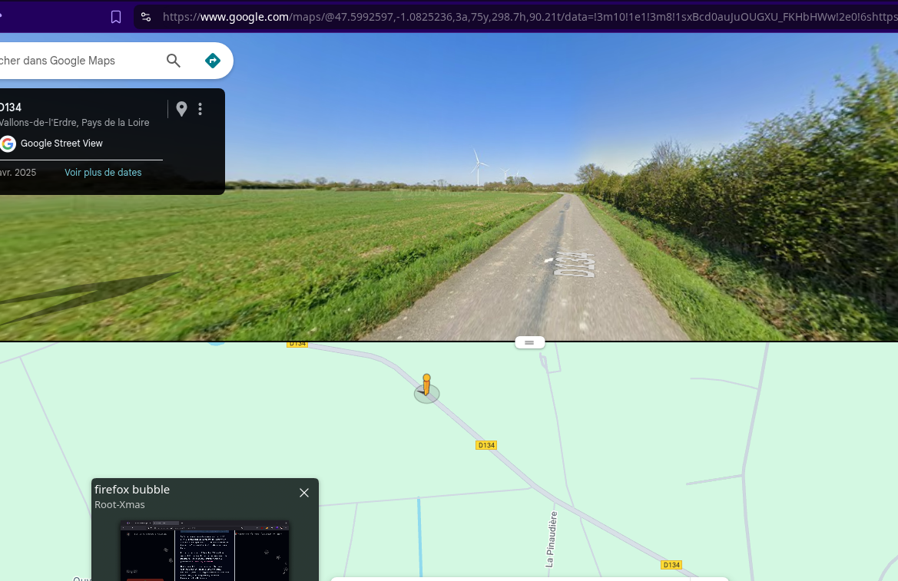
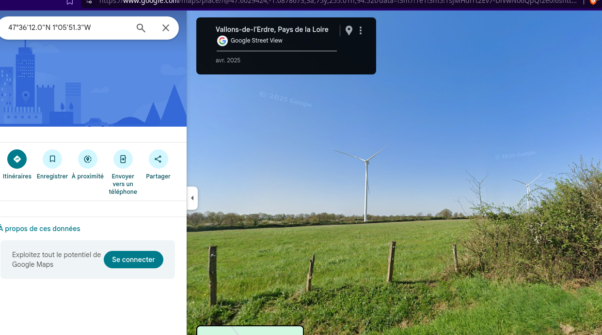

Using an overpass turbo request, we can spot a group of 3 windmills, the closest one from Le Pin, where the FPV disappeared:

There we need to use google's street view to move along the road:

From the closest road to the D134 (North-East), we find the pasture enclosed with the small barrier.

