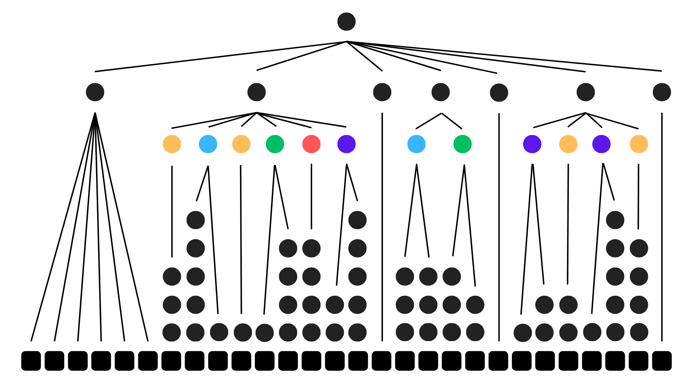

## Grammar

- flag = start, word, {underscore, word}, end;
- start = "l", "a", "c", "t", "f", "{";
- end = "}";
- underscore = "_";
- word = fragment, {fragment};


**fragment = colored circles on which the rules apply** ( c | d | cd | vc | vd) 


child of circles :
	- 1 branch  : fragment is c | d
	- 2 branches : fragment is cd | vc | vd

```txt
fragment
   |
  vc
 /   \
vow   con
```

### Identifying with transitions

**transitions = black circles which represent transformations/replacement**. 
Example: in order to reach letter 'r', we must achive 6 transitions on `cons` parent node: `cd -> con -> con2 -> con3 -> con4 -> con5 -> r`

- cons: max **cons5 <= 6 transitions**
- dig : max **dig4 <= 5 Transitions**
- vox: max **vox3 <= 4 transitions**

Exemple is `aaab` in this language:

- S = aA | bB
- A = a | aB | aA
- B = bB | b

```txt
   S
   |
a  A  (aA)
   |
a  A  (aaA)
   |
a  B  (aaaB)
   |
   b  (aaab) <= yes
```

## Description

`FLAG = lactf{ABACDE_BC_EABA}`

- start = `lactf{`
- 2 underscores (between words)
- end = `}`

3 words:

- word 1 = 6 fragments
- word 2 = 2 fragments
- word 3 = 4 fragments

In order to find chars, we must identify fragments using the number of transitions inside of them:



- A = c|d , 4 transitions and 2 and 3 and 5 (max 5 transition)
- B = cd | vc | vd, (6,2) and (4,4) => only c has 6 transitions so B = cd
- C = cd | vc | vd, (2,5) and(4,3)
- D = c|d , 5 transitions
- E = cd | vc | vd , (3,6) and (2,3) and (2,6), only c has 6 transitions so E = vc

Known:

```txt
B = cd
E = vc
```

Unkown:

```txt
A = c|d
C = cd | vc | vd
D = c|d
```

### Solve

```txt
B => (c5,d1) (occur1) and (c3,d3) (occur2)
E => (v2,c5) and (v1,c2) and (v1,c5)
```

For now:

`FLAG = lactf{A r0 A CC D or _ p4 CC _ eg A er A}`

### Supposition on A

`A = d`:

FLAG = lactf{4 r0 0 CC D or_p4 CC_eg 1 er 5}

`A = c` (seems good):

`FLAG = lactf{p r0 f CC D or _ p4 CC _ eg g er t}`


We guess the word 1 as "p ro f es s or" :

```txt
A = c
C = ?
D = ?
```

`FLAG = lactf{p r0 f CC D or _ p4 CC _ eg g er t}`

### Supposition on D

`D = c`:

FLAG = lactf{p r0 f CC t or _ p4 CC _ eg g er t}


`D = d` (seems good):

`FLAG = lactf{p r0 f CC 5 or _ p4 CC _ eg g er t}`

### Supposition on C

`C = vc`

FLAG = lactf{p r0 f et 5 or _ p4 ug _ eg g er t}


`C = vd` (seems good):

`FLAG = lactf{p r0 f e5 5 or _ p4 u1 _ eg g er t}`

So the flag is:

`lactf{pr0fe55or_p4u1_eggert}`
