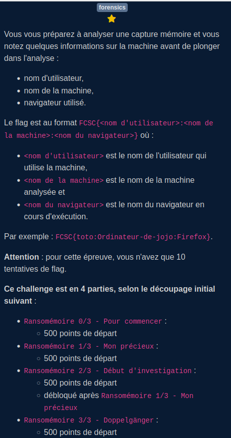

# Memdump

[**Dump à télécharger ici**](https://mega.nz/file/9P0ikKbA#1oqmduFzriV5oU-i3U41XVo_3IrtR8OkVbaHEhSS2Mw)

## Partie 0/3

On lance  `python ~/volatility~/vol.py -f fcsc envars`

En faisant un grep :

- sur COMPUTERNAME : on obtient le nom de l'ordinateur 7516    svchost.exe     0x29bf9603310   COMPUTERNAME    DESKTOP-PI234GP
- sur USERPROFILE : on obtient un compte intéressant lançant un navigateur 4072    brave.exe       0x1c78b981c80   USERPROFILE     C:\Users\Admin

`FCSC{Admin:DESKTOP-PI234GP:Brave}`

## Partie 1/3

Fichier secret -> capture mem?

pslist donne:

1484 : Memcompression?

dump:
