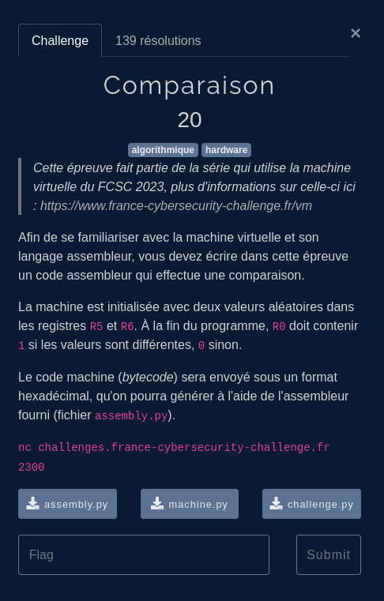
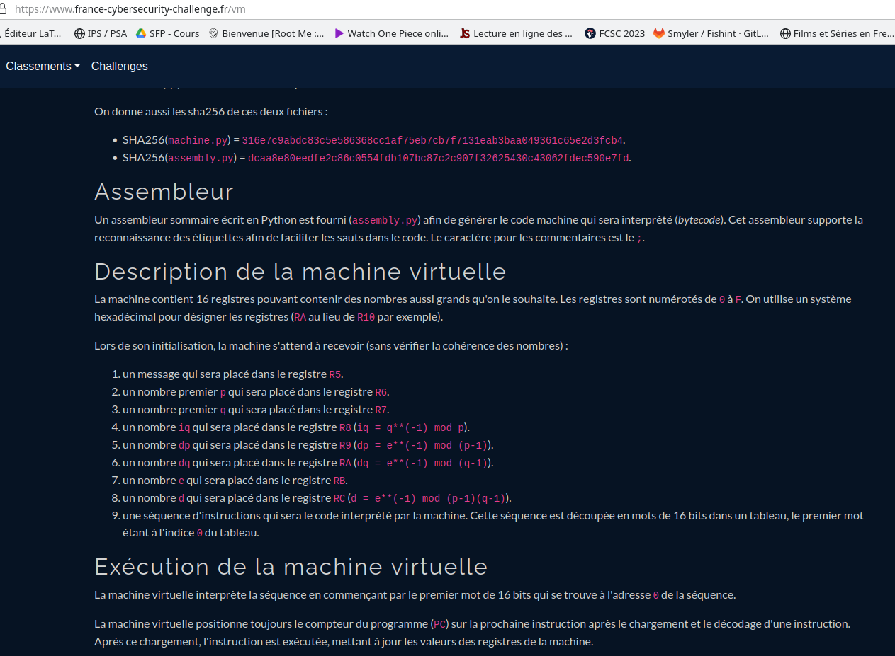
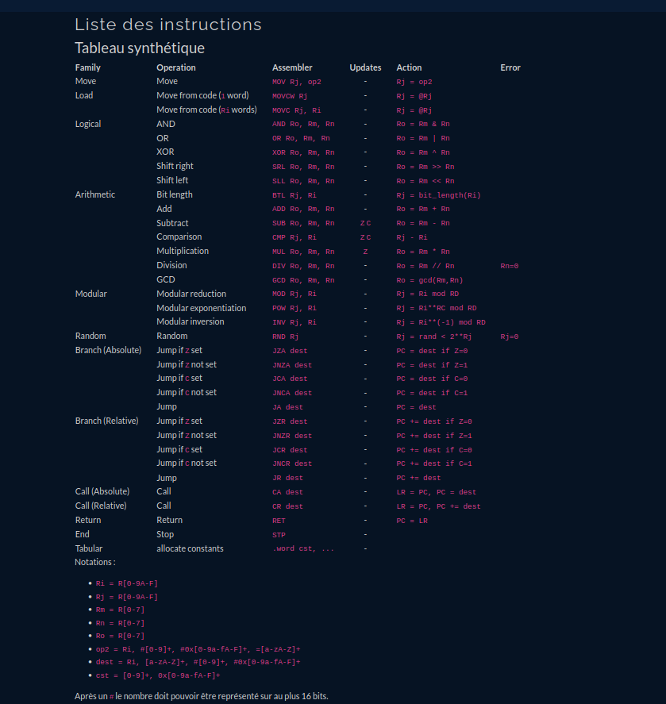
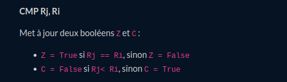
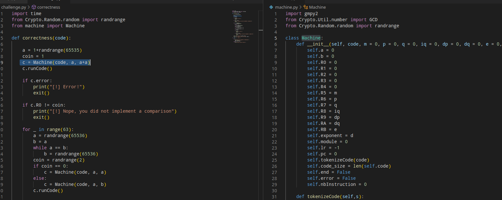
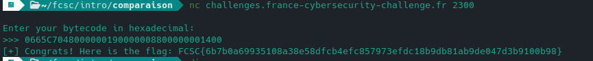
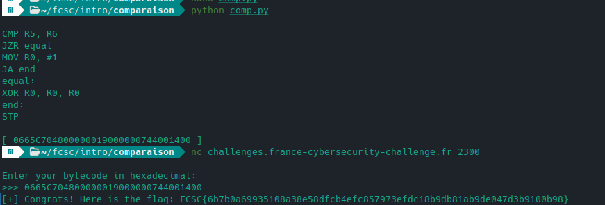
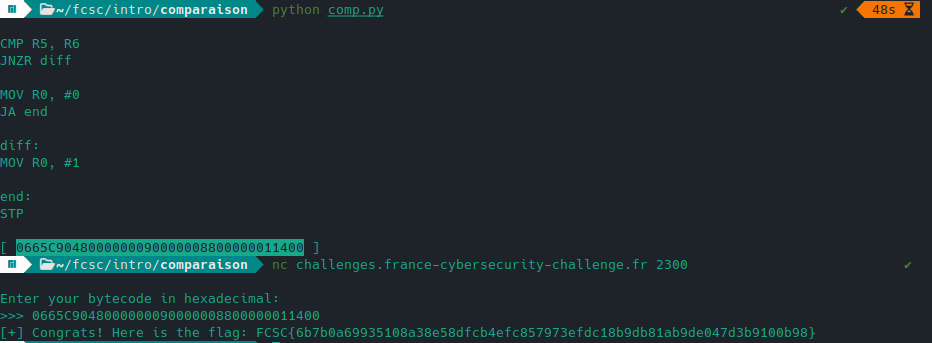

## Enonce



Nous avons une machine virtuelle dans machine.py qui comprend ses propres instructions assembleur et transforme en "bytecode" = nombres pour le challenge.
Les opcodes attendus et associés à chaque instruction sont définis dans assembly.py.
Pour l'utiliser nous devons compiler nos instructions comme ceci:



## Compilation

On crée donc notre compilateur:

```python
from assembly import assembly

source=""

def compile(code):
        global source
        source = code
        z = assembly(code.upper().split('\n'))
        print(code)
        print("[",z,"]")
        return z.encode()

def stub():
        code = f"""
                STP;
                """
        return compile(code)

stub()
```

## Instructions



On avait aussi le détail des instructions notamment CMP, avec le bool Z:



## Comparaison

La machine est initialisée avec R5=a et R6=2a



Voici un code possible à compiler:

```asm
CMP R5, R6 ; compare R5 à R6
JZR equal  ; saute à equal si R5=R6
MOV R0, #1 ; sinon met 1 dans R0
JA end     ; saute à la fin
equal:     ; si R5=R6
MOV R0, #0 ; met 0 dans R0
end:       ; fin
STP
```

## Flag



Parfois en exploitation de binaire on souhaite éviter les null bytes (shellcodes), ainsi on peut aussi XOR:



On peut aussi utiliser regarder si R5!=R6:


