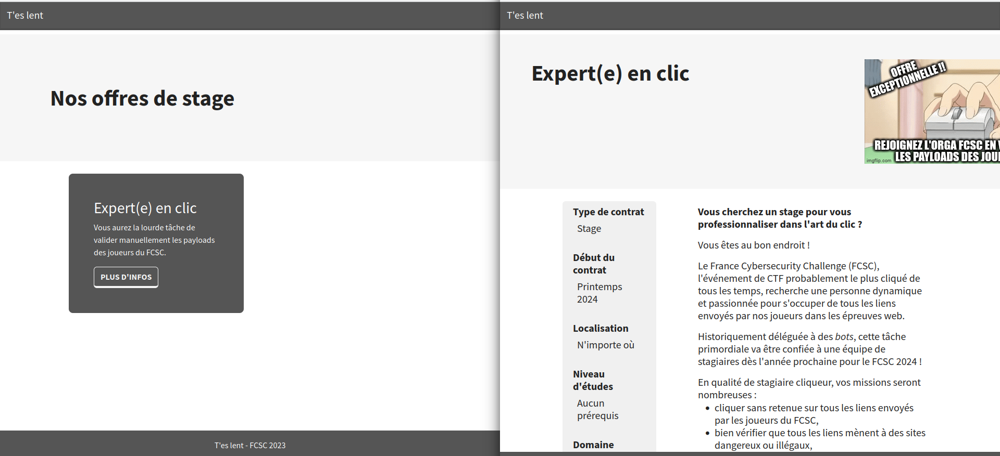
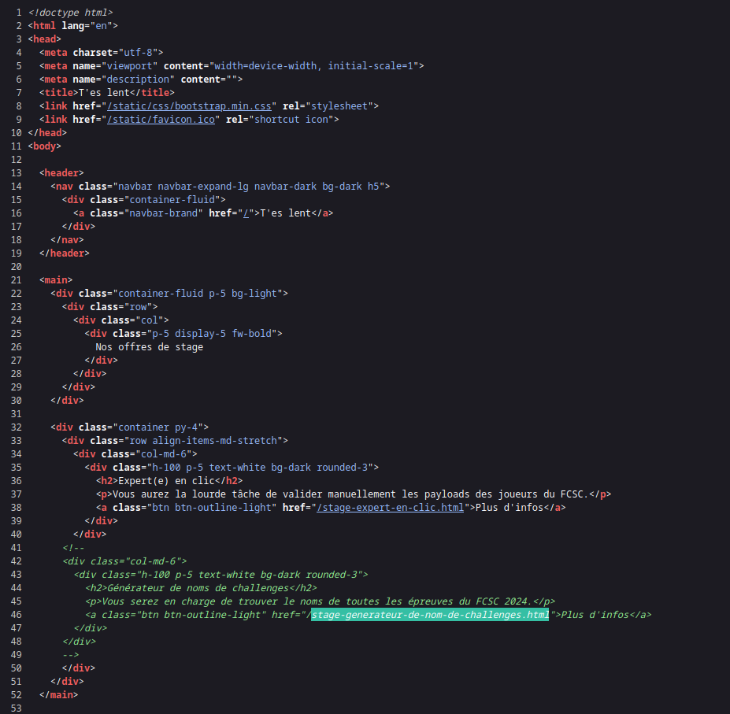
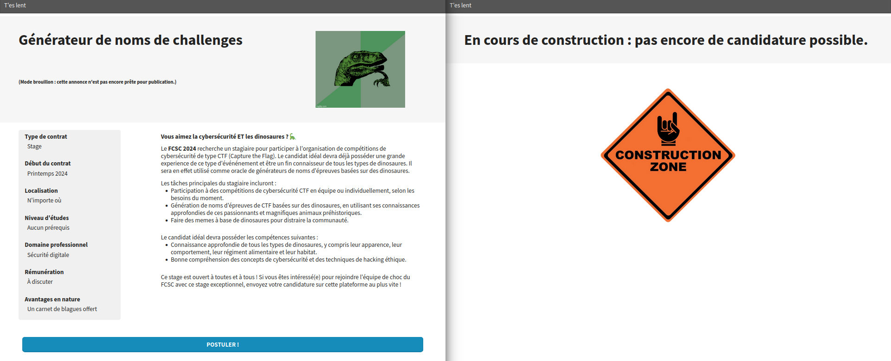
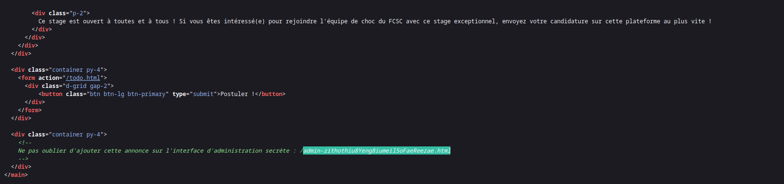
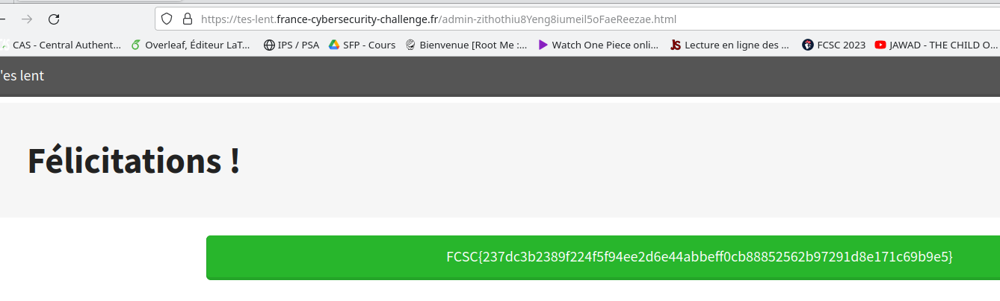

## Code source

On découvre une offre de stage. Sur l'offre rien de spécial.

On revient sur la première page, une section était cachée dans le code source!

On découvre alors l'offre cachée. Cependant celle ci nous redirige vers une page vide.

On réapplique alors la même méthode: regarder le code source:

Une section admin?

## Flag

Facile!

