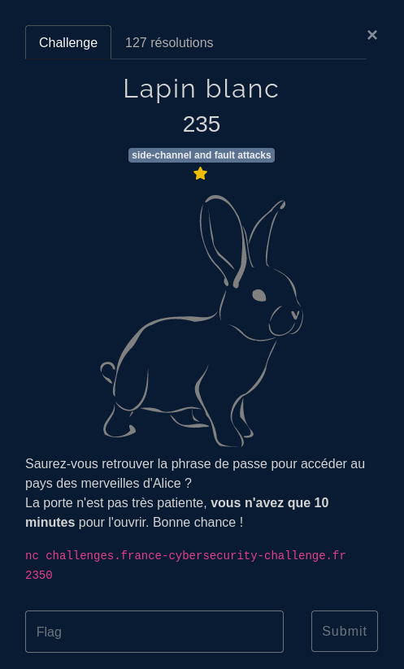
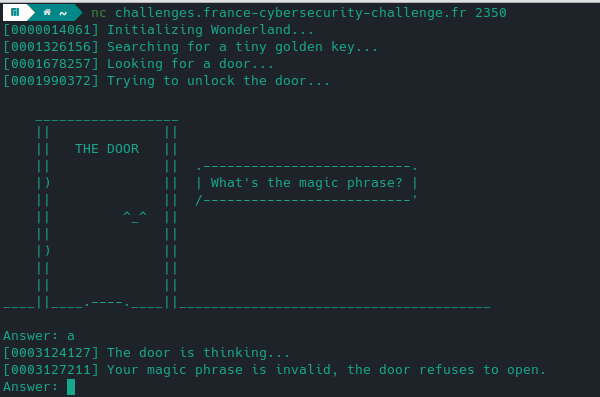
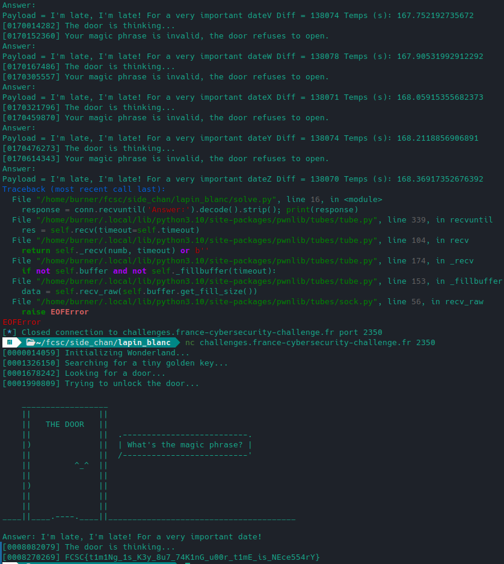

## Enonce



## Résolution

C'est une attaque time based, attention à prendre en compte les 2 nombres renvoyés par le serveur et pas `time.time()`.



On remarque que pour certains caractères, le temps de différence de réponse (serveur) est bien plus grand que les autres.
On peut penser à un algo naïf en prenant le max mais cela prend 10 min.

```python
from pwn import *
import re, string, statistics, time

charset = string.printable[:-5]
flag = ""

conn = remote('challenges.france-cybersecurity-challenge.fr', 2350)
conn.recvuntil('Answer:')

start = time.time()
for _ in range(1000):
        list = []
        for c in charset:
                payload = flag + c + '\n'
                conn.send(payload)
                response = conn.recvuntil('Answer:').decode().strip(); print(response)
                numbers = re.findall(r'\d+', response)
                diff = int(numbers[1]) - int(numbers[0])
                list.append(diff)
                tps = time.time() - start
                print(f"Payload = {payload.strip()} Diff = {diff} Temps (s): {tps}")
                if diff > 1.25*statistics.mean(list):
                        flag += c
                        print(f"[+] Flag = {flag}")
                        break

conn.close()
```

C'est sale (bidouillage à la main) mais ça fonctionne en moins de 3 minutes:




