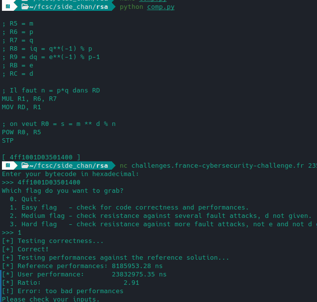
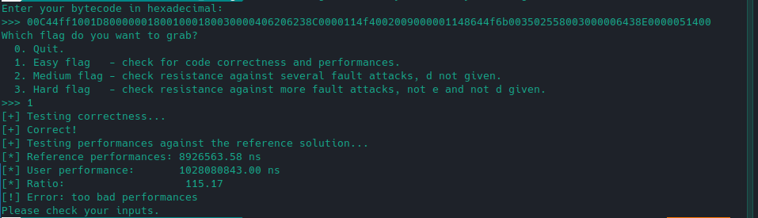
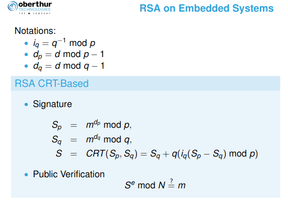
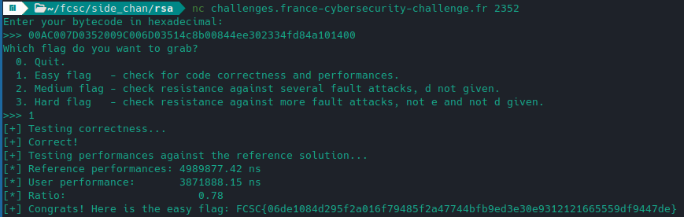
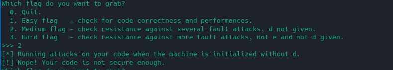
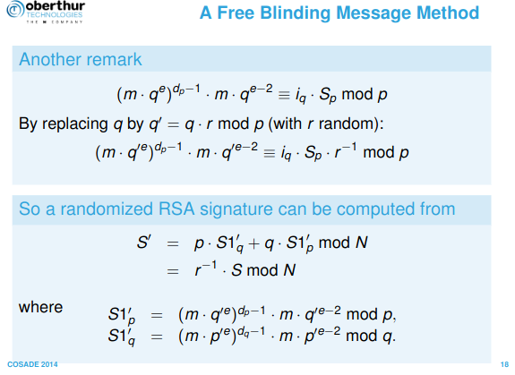
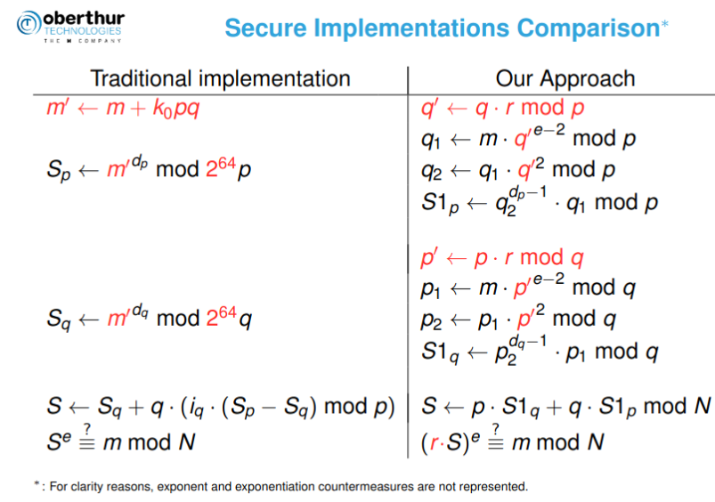
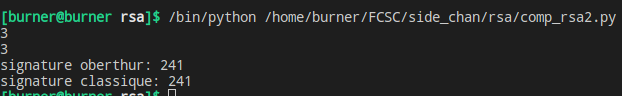
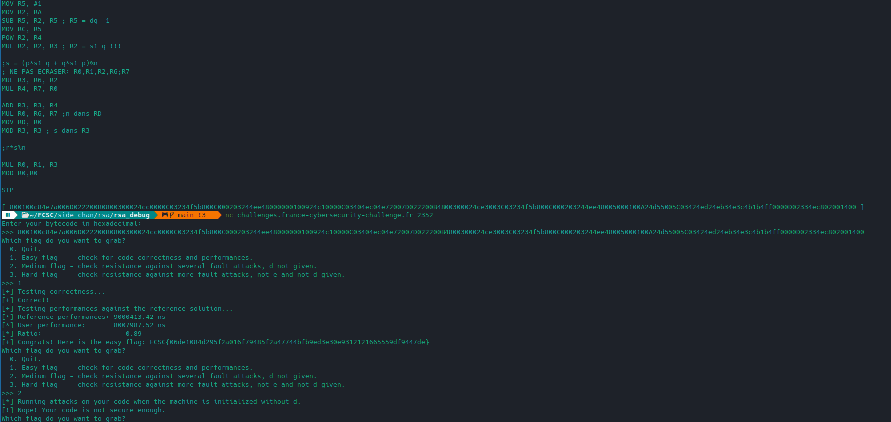

# RSA 1/3

Voir les challenges:

-  pour le défi précédent utilisant la machine virtuelle.
-  pour comprendre son fonctionnement.

`./rsa_debug` contient une vm modifiée permettant de débugger le code facilement.


Note: `Obiture` était sans doute un indice pour trouver la doc (pdf d'`Oberthur Technologies`) permettant de faire les 3 challs, jsuis tombé dessus par hasard ...

## Naïf

On peut penser à exploiter l'instruction `POW` déjà présente. Cependant la contrainte de performance n'est pas vérifiée:



## Méthode des carrés

Une idée classique est cette méthode documentée ici ou là:

https://www.bibmath.net/dico/index.php?action=affiche&quoi=./e/exponentiationrapide.html

https://python.jpvweb.com/python/mesrecettespython/doku.php?id=exponentiation

En gros ça consiste à calculer un certain nombre de fois m^2 selon la parité de d, avec une séduisante complexité en `ln(n)`.

Serait-ce plus optimisé?

```asm
; R5 = m
; R6 = p
; R7 = q
; R8 = iq = q**(-1) % p
; R9 = dp = e**(-1) % p-1
; RA = dq = e**(-1) % q-1
; RB = e
; RC = d

; Init
MOV R4, RC ; on met d dans R4

; Il faut n = p*q dans RD
MUL R1, R6, R7
MOV RD, R1

; on veut R0 = s = m ** d % n
;             POW R5, R4 (RC) (, RD)

; result
MOV R0, #1

EXP_LOOP:
        MOV R1, #1
        MOV R3, #0
        
        ;if d&1>0
        AND R2, R4, R1
        CMP R3, R2
        JCA SKIP
        IF:
                ; res = res*m %n
                MUL R0, R0, R5
                MOD R0, R0
				JA SKIP

		SKIP:
        ; d = d >>1
        SRL R4, R4, R1
        ; m = m*m%n
        MUL R3, R5, R5
        MOV R5, R3
        MOD R5, R5

        ;tq d>0
		MOV R3, #0
        CMP R3, R4
        JNCA EXP_LOOP

STP
```



Visiblement réinventer la roue ne nous a pas été utile!

## Optimisation avec q^(-1)

`POW` était donc bien nécessaire mais comment faire mieux?

En faisant une recherche, curieux de connaître `iq, dp et dq` on tombe sur ceci: https://www.cosade.org/cosade19/cosade14/presentations/session2_b.pdf

On peut découper le travail en calculant l'exponentiation sur p et q de tailles bien plus petites.
Tout ceci tient au `théorème des restes chinois`:



https://www.di-mgt.com.au/crt_rsa.html

Attention à certaines spécifités:

- `RD` doit contenir le modulo de l'opération (MOD ou POW) , `RC` : l'exposant (d, p ou q)
- `MUL` ne peut opérer que sur `R[0-7]`

```asm
; R5 = m
; R6 = p
; R7 = q
; R8 = iq = q**(-1) % p
; R9 = dp = e**(-1) % p-1
; RA = dq = e**(-1) % q-1
; RB = e
; RC = d
; RD = n

; dp en exp
; p en mod
MOV RC, R9
MOV RD, R6
POW R1, R5 ;s1 = m**dp %p

; dq en exp
; q en mod
MOV RC, RA
MOV RD, R7
POW R2, R5 ;s2 = m**dp %q

; p en mod
; s1-s2 dans R3
; iq*(s1-s2) dans R4 
; h = iq*(s1-s2) %p dans R0
MOV RD, R6
SUB R3, R1, R2
MOV R4, R8
MUL R3, R4, R3 ;ATTENTION : R[0-7] pour MUL
MOD R3, R3

; s2 + hq dans R0
MUL R1, R3, R7
ADD R0, R2, R1

STP
```



# RSA 2/3

Ceci ne marche évidemment pas pour le 2nd test:



## Résolution

On reprend cette doc : https://www.cosade.org/cosade19/cosade14/presentations/session2_b.pdf



L'idée est d'utiliser un facteur aléatoire dans la signature RSA:



On teste en python voir si ça marche:

```python
r = 2371   #rand
q = 17
m = 3
p = 19
e = 65537
phi = (p-1)*(q-1)
d = pow(e,-1,phi)

n = p*q
dp = pow(e,-1,p-1)
dq = pow(e,-1,q-1)

#algo

q_prim = (q*r)%p
q1 = m*pow(q_prim,e-2,p)
q2 = q1*pow(q_prim,2,p)
s1_p = (q1*pow(q2,dp-1,p))%p

p_prim =  (p*r)%q
p1 = m*pow(p_prim,e-2,q)
p2 = p1*pow(p_prim,2,q)
s1_q = (p1*pow(p2,dq-1,q))%q

s = (p*s1_q + q*s1_p)%n

print(pow(r*s,e,n)%n)
print(m)

# On veut r*s%n
print("signature oberthur:", r*s%n)
print("signature classique:",pow(m,d,n))
```



Vient l'implémentation en asm ...:

```asm
; R5 = m
; R6 = p
; R7 = q
; R8 = iq = q**(-1) % p
; R9 = dp = e**(-1) % p-1
; RA = dq = e**(-1) % q-1
; RB = e
; RC = d = exp
; RD = n = module

MOV R1, #200 ;r

;partie 1: s1_p
;q_prim = (q*r)%p
MUL R2, R7, R1
MOV RD, R6
MOD R2, R2

;q1 = m*pow(q_prim,e-2,p)
MOV R0, RB
MOV R3, #2
SUB R0, R0, R3
MOV RC, R0
POW R3, R2
MUL R3, R3, R5

;q2 = q1*pow(q_prim,2,p)
MOV RC, #2
POW R4, R2
MUL R4, R4, R3

;s1_p = q1*pow(q2,dp-1,p)
MOV R0, #1
MOV R2, R9
SUB R0, R2, R0 ; R0 = dp -1
MOV RC, R0
POW R0, R4
MUL R0, R0, R3 ; R0 = s1_p !!!

;partie 2: s1_q
; NE PAS ECRASER: R0,R1,R5,R6,R7
;p_prim = (p*r)%q
MUL R2, R6, R1
MOV RD, R7
MOD R2, R2

;p1 = m*pow(p_prim,e-2,q)
MOV R4, RB
MOV R3, #2
SUB R3, R4, R3
MOV RC, R3
POW R3, R2
MUL R3, R3, R5

;p2 = p1*pow(p_prim,2,q)
MOV RC, #2
POW R4, R2
MUL R4, R4, R3

;s1_q = p1*pow(p2,dq-1,q)
MOV R5, #1
MOV R2, RA
SUB R5, R2, R5 ; R5 = dq -1
MOV RC, R5
POW R2, R4
MUL R2, R2, R3 ; R2 = s1_q !!!

;s = (p*s1_q + q*s1_p)%n
; NE PAS ECRASER: R0,R1,R2,R6;R7
MUL R3, R6, R2
MUL R4, R7, R0

ADD R3, R3, R4
MUL R0, R6, R7 ;n dans RD
MOV RD, R0
MOD R3, R3 ; s dans R3

;r*s%n

MUL R0, R1, R3
MOD R0,R0

STP
```



Super ... c'est correct, performant résiste à Bellcore mais ça passe pas!
