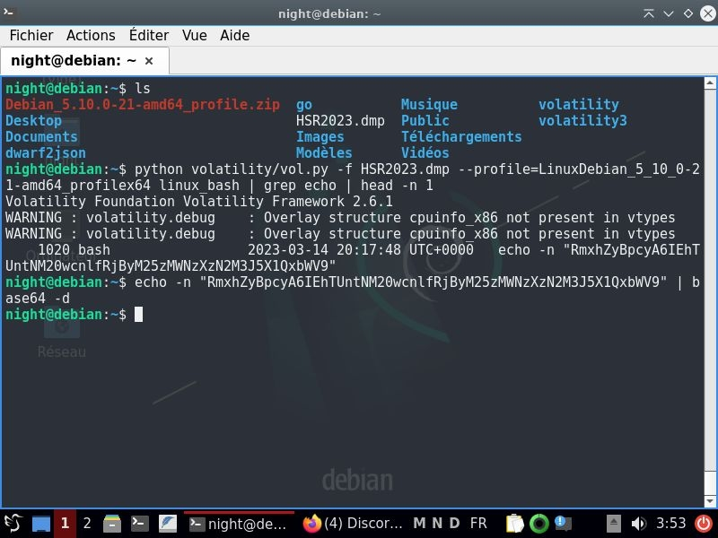

## Challs makhno (voir wu pdf Smyler)

Dump disponible ici : https://mega.nz/file/hDN3DbzK#FkVQP2U9GfsB_HIG_JUbHD5h0KyP0rAQiI8nS97O7oc

# Connaître le kernel

```
    ~/Writeup/HackSecuReims/forensic/challs_mahkno    master ?4    python ~/volatility3/vol.py -f HSR2023.dmp banners.Banners                                                                                                    ✔ 
Volatility 3 Framework 2.4.2
Progress:  100.00               PDB scanning finished                  
Offset  Banner
     
0xc800200       Linux version 5.10.0-21-amd64 (debian-kernel@lists.debian.org) (gcc-10 (Debian 10.2.1-6) 10.2.1 20210110, GNU ld (GNU Binutils for Debian) 2.35.2) #1 SMP Debian 5.10.162-1 (2023-01-21)
```

# Installer les headers, symboles de debug et utilitaires

On crée une VM avec l'iso de Debian11:
```
sudo apt install linux-headers-5.10.0-21-amd64 linux-image-5.10.0-21-amd64-dbg git build-essential dwarfdump make zip golang
```

# Construire le profil avec Vol2

```
git clone https://github.com/volatilityfoundation/volatility
cd volatility/volatility/tools/linux
make 
cd
zip $(lsb_release -i -s)_$(uname -r)_profile.zip volatility/tools/linux/module.dwarf /usr/lib/debug/boot/System.map-5.10.0-21-amd64
cp Debian_5.10.0-21-amd64_profile.zip volatility/plugins/overlays/linux
```



```
    ~/Writeup/HackSecuReims/forensic/challs_mahkno    master ?4     echo -n "RmxhZyBpcyA6IEhTUntNM20wcnlfRjByM25zMWNzXzN2M3J5X1QxbWV9" | base64 -d                                                                        ✔  9s  
Flag is : HSR{M3m0ry_F0r3ns1cs_3v3ry_T1me}
```
