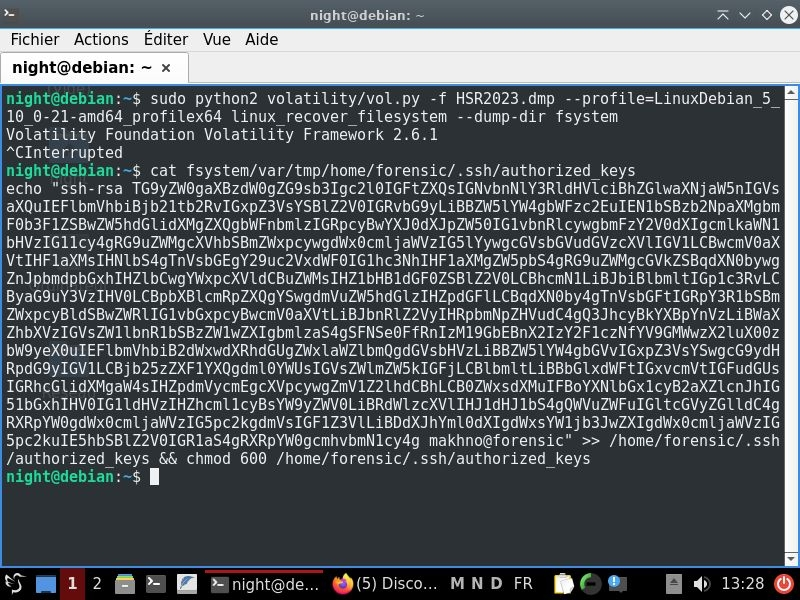
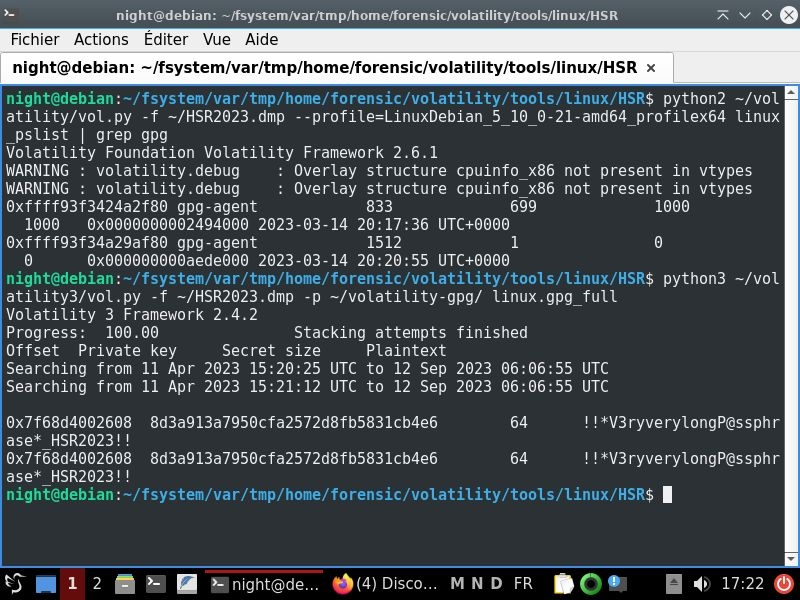
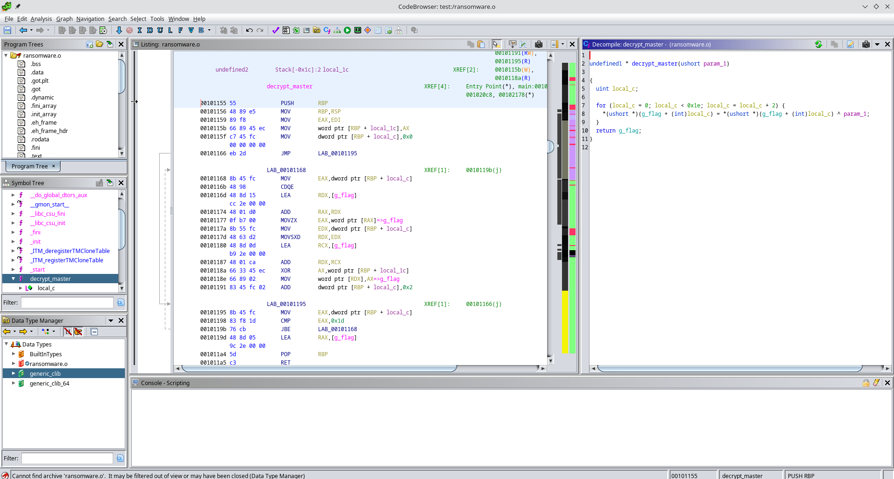
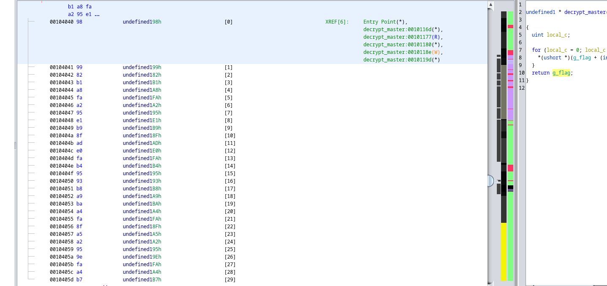

# Challs makhno (voir [le wu de Smyler](./Writeup.pdf))

Challenge/Dump disponible ici : https://mega.nz/file/hDN3DbzK#FkVQP2U9GfsB_HIG_JUbHD5h0KyP0rAQiI8nS97O7oc
Doc : [HTB](https://www.hackthebox.com/blog/memory-forensics-volatility-write-up)

# Flag1

En pratique je ne m'étais intéressé au challenge qu'à la fin et n'avait pas dépassé la simple recherche à coup de grep.
Ce README a pour objectif personnel de refaire l'exploitation.

## Connaître le kernel

On utilise **banners.Banners**

```bash
python ~/volatility3/vol.py -f HSR2023.dmp banners.Banners
Volatility 3 Framework 2.4.2
Progress:  100.00               PDB scanning finished                  
Offset  Banner
     
0xc800200       Linux version 5.10.0-21-amd64 (debian-kernel@lists.debian.org) (gcc-10 (Debian 10.2.1-6) 10.2.1 20210110, GNU ld (GNU Binutils for Debian) 2.35.2) #1 SMP Debian 5.10.162-1 (2023-01-21)
```

## Installer les headers, symboles de debug et utilitaires

On crée une VM avec l'iso de Debian11:

```bash
sudo apt install linux-headers-5.10.0-21-amd64 linux-image-5.10.0-21-amd64-dbg git build-essential dwarfdump make zip
```

## Construire le profil avec vol2

Attention, le profil crée se nommera **LinuxDebian_5_10_0-21-amd64_profilex64**, la plupart des plugins seront en **linux_bash, linux_pslist** etc.

```bash
git clone https://github.com/volatilityfoundation/volatility
cd volatility/volatility/tools/linux
make 
cd
zip $(lsb_release -i -s)_$(uname -r)_profile.zip volatility/tools/linux/module.dwarf /usr/lib/debug/boot/System.map-5.10.0-21-amd64
cp Debian_5.10.0-21-amd64_profile.zip volatility/volatility/plugins/overlays/linux
```

## Construire les symboles vol3 (pour la partie 3 - plugin GPG)

**Attention: avoir une RAM > 5Go** pour./dwarf2json

```bash
git clone https://github.com/volatilityfoundation/dwarf2json
cd dwarf2json/
go mod download github.com/spf13/pflag
go build
./dwarf2json linux --elf /usr/lib/debug/vmlinux-5.10.0-21-amd64 > ~/vmlinux-5.10.0-21-amd64.json
cd
cp vmlinux-5.10.0-21-amd64.json volatility3/volatility3/symbols
```


Pour plus de clarté, l'historique obtenu a été copié dans [bash_history.txt](./bash_history.txt). On y observe notamment:

```bash
echo -n "RmxhZyBpcyA6IEhTUntNM20wcnlfRjByM25zMWNzXzN2M3J5X1QxbWV9" | base64 -d 
Flag is : HSR{M3m0ry_F0r3ns1cs_3v3ry_T1me}
```

# Flag2

Le challenge évoquait un *accès permanent*.
D'après l'historique, l'utilisateur a  manipulé son .ssh.
Nous allons reconstruire l'arborescence du dump avec le plugin **linux_recover_filesystem** en root pour ne pas se soucier des permissions.



La clé est étrange et semble en base64, on vérifie et trouve au milieu un flag:

```
HSR{A_Fr33_Fl@g_b3caus3_a_F1l3_in_M3mory}
```


# Flag3

Le challenge évoquait des *fichiers chiffrés*.

```bash
1020 bash                 2023-03-14 20:20:26 UTC+0000   gpg --symmetric --cipher-algo AES-256 -o flag.enc flag.pdf
...
1020 bash                 2023-03-14 20:21:14 UTC+0000   base64 HSR/flag.enc > HSR/flag.enc.b64
```
D'après l'historique, l'utilisateur a chiffré avec gpg un fichier *flag.pdf*.
Un find nous indique 1020 bash l'emplacement du clair mais effacé.

```bash
./var/tmp/media/sf_DUMP
```

**Attention: vol3 nécessaire ici:**

- On vérifie les processus listés
- On utilise un plugin trouvé facilement sur google pour retrouver la clé:

```bash
git clone 'https://github.com/kudelskisecurity/volatility-gpg'
```



La clé obtenue permet de recouvrer le flag:

```bash
root@debian:/home/night/fsystem/var/tmp/home/forensic/volatility/tools/linux/HSR# ls
flag.enc.b64  ransomware.o
root@debian:/home/night/fsystem/var/tmp/home/forensic/volatility/tools/linux/HSR# base64 -d flag.enc.b64 > flag.enc
root@debian:/home/night/fsystem/var/tmp/home/forensic/volatility/tools/linux/HSR# gpg -d flag.enc > flag.pdf
gpg: données chiffrées avec AES256.CFB
gpg: chiffré avec 1 phrase secrète
root@debian:/home/night/fsystem/var/tmp/home/forensic/volatility/tools/linux/HSR# ls
flag.enc  flag.enc.b64  flag.pdf  ransomware.o
```

Flag , cf [flag.pdf](./flag.pdf):

```HSR{V0l@tility_w1th_GPG_1s_c00l_too!!!}
```

# Flag4

On dispose par la même occasion du binaire `ransomware.o` que l'on va analyser dans Ghidra.
On remarque une fonction `decrypt_master` qui fait un xor entre une section mémoire et un short:

```c
undefined8 main(void)

{
  undefined2 local_12;
  undefined8 local_10;

  puts("[>] 3vil-kevin ransomware 0.0.1-dev");
  puts("[>] Enter 16-bit military grade cryptographic key :");
  __isoc99_scanf(&DAT_00102064,&local_12);
  puts("[+] Decrypting master key...");
  local_10 = decrypt_master(local_12);
  printf("!! TODO ENCRYPT FILE WITH %s\n",local_10);
  return 0;
}
```



En supposant que la section mémoire déchiffrée soit le flag, nous avons cependant un clair connu(HSR{).
En sortant le chiffré et en écrivant un court script python, on obtient le flag:



```python
enc = bytes.fromhex("989982b1a8faa295e1b98fade0fab49593b8a9baa4fa8fa5a2959efaa4b7")
dec = bytearray()
key1 = enc[0] ^ ord('H')
key2 = enc[1] ^ ord('S')
for i, x in enumerate(enc):
	if i % 2 == 0:
		dec.append(key1 ^ x)
	else:
		dec.append(key2 ^ x)
print(dec)
# HSR{x0r_1s_g00d_Crypt0_or_N0t}
```
