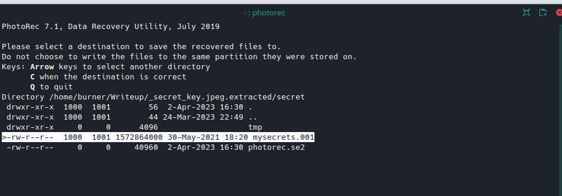
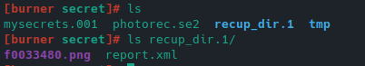
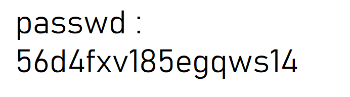

# Secret key

Nous avons une image secret.png un peu lourde, l'énoncé nous dit que le flag se situera à côté d'une mention 'passwd'.

## Extraction zip

On extrait donc son contenu:

`binwalk -e secret.png`

On obtient un zip, qu'on essaie de dézipper avec 7zip au vu de la version, mais protégé par mot de passe:

 pour faire du file carving:

## Flag

Un dossier recupdir apparaît avec une image:

C'est le flag!

