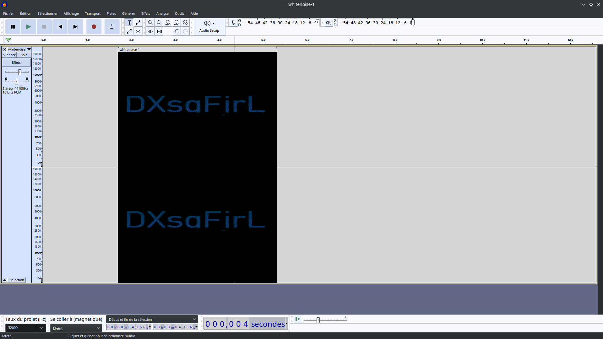
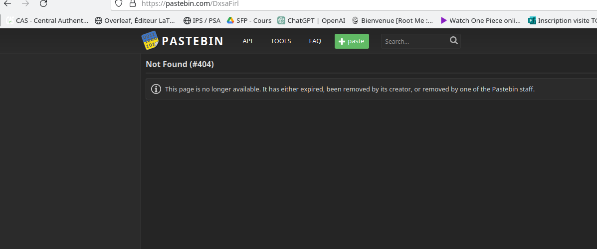

# whitenoise

## spectre

On ouvre le fichier wav avec audacity.
En regardant le spectre on tombe sur une chaîne de caractère:

## pastebin

L'indice dit que l'on a trouvé un "ID".
On peut alors penser à un lien raccourci: tinyurl ou *pastebin*.

## whitespace

La note a été effacée , mais nous tombions sur du whitespace, qui nous donnait outre un rickroll, le flag.
